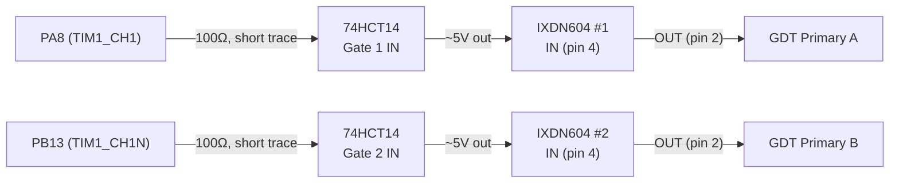
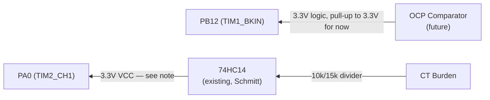
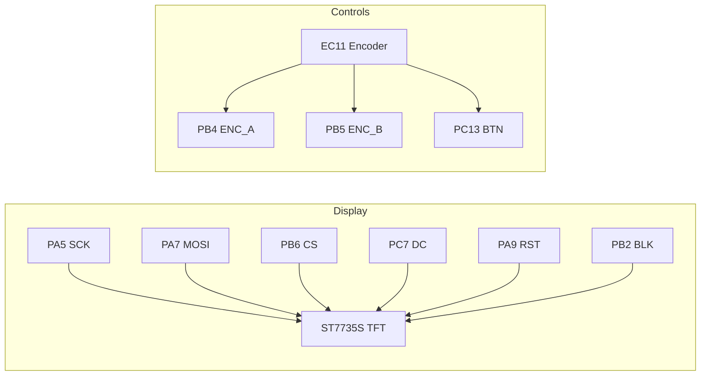
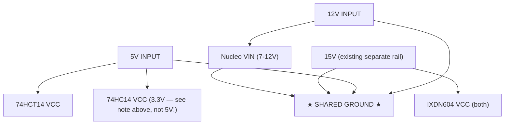

# Board v2 — Direct-to-Morpho Design (supersedes JST harness)

Simplified single-perfboard design. Nucleo sits directly on morpho headers,
all signal traces short. No isolators, no stacked perf, no JST harness.
See `docs/SHIELD_LAYOUT.md` and `docs/JST_CONNECTORS.md` for the deprecated
v1 design and lessons learned (ADuM1201 pinout mismatch, BKIN latch behavior
— still useful background even though the topology changed).

## Why the change

v1 (stacked perf + JST + Si8621 isolators) had long flying leads and
hand-soldered SOIC-8 breakouts — too many failure points, confirmed the hard
way debugging a dead isolator channel. v2 removes both: single board, short
direct traces, isolators dropped (their isolation rationale was already gone
once we went single-star-ground; see below for what replaces their level-shift
function).

---

## PWM Output Path (Nucleo → 74HCT14 → IXDN604 → GDT)

> **Need SN74HCT14N (TI) for this level-shift — NOT the SN74HC14N you have on
> hand.** IXDN630MCI needs VIH=3.5V min. The genuine TI SN74HC14N at
> VCC=4.5-5V has VIH≈3.15-3.5V (0.7×VCC, CMOS-level) — a 3.3V input from the
> Nucleo is marginal/out-of-spec against that. The SN74HCT14N has
> TTL-compatible inputs, VIH=2.0V FIXED regardless of VCC, so 3.3V clears it
> with real margin. Pin-compatible drop-in, same DIP-14 footprint.
>
> **STATUS: only SN74HC14N confirmed in parts drawer. SN74HCT14N needs to be
> sourced (Mouser/Digikey) or an alternative found — see options below.**
>
> 10kΩ pulldown stays on each IXDN604 input (fail-safe if this gate's output
> is ever disconnected).

### Options until the HCT part arrives

1. **Order SN74HCT14N** — cheap, few dollars, same footprint as what you
   already have wired experience with. Cleanest long-term fix.
2. **Run the SN74HC14N you have from a LOWER VCC** — HC-family VIH scales
   with VCC (VIH=0.7×VCC). At VCC=3.3V, VIH≈2.3V, comfortably below your
   Nucleo's 3.3V output. BUT the chip's OUTPUT then only swings to ~3.3V,
   which is BELOW the IXDN630's VIH=3.5V — same problem, just moved to the
   output side. **This does not work** — don't use this option.
3. **Bench-test the HC14 you have anyway, at 5V, with the 3.3V input** — HC
   parts often still switch correctly with a 3.3V input even though it's
   below the datasheet-guaranteed VIH, because real silicon has margin beyond
   worst-case spec. You could verify on the AD3: feed 3.3V logic in, confirm
   clean 5V square wave out, check propagation delay/edges look normal. If it
   works reliably, it MIGHT be usable — but you're now relying on unspecified
   margin rather than a guaranteed threshold, which is risky right next to
   IGBTs. Not recommended for anything beyond a quick bench check.
4. **Any other TTL-input buffer/gate you have** — 74LS14, 4050/4049 (CMOS
   buffer with wide input tolerance), or a simple 2N7000 MOSFET level-shift
   circuit would also work if something's in the drawer already.

**Recommendation: order the SN74HCT14N.** It's inexpensive and removes the
ambiguity entirely — same lesson as the isolator debug: don't build on
marginal specs next to a 400A inverter.

## Feedback / Fault Path (Power stage → Nucleo)

> **Run the existing 74HC14 (CT frequency conditioner) from 3.3V, not 5V.**
> Its output feeds directly into PA0 — a 5V swing would exceed the Nucleo's
> GPIO absolute max (~VDD+0.3V ≈ 3.6V). At 3.3V VCC, HC14 thresholds become
> VIH≈2.3V / VIL≈1.0V — recheck the CT divider still crosses these cleanly.
> **BKIN (PB12):** until the OCP comparator is built, add a pull-up to
> **3.3V** (not 5V) so it idles safely HIGH (break inactive). When the
> comparator is added, its output must also be 3.3V-logic (or clamped/divided)
> before reaching PB12 — never feed it 5V directly.

## User Interface (unchanged from v1)

## Power Distribution (shared ground, no isolation)

> Correction to the note above: if 74HC14 runs from 3.3V, source that 3.3V
> from the Nucleo's own regulator output (short trace), not the 5V input rail.
> So really: **12V → Nucleo VIN**, **5V → 74HCT14 + IXDN604 logic-adjacent
> needs**, **Nucleo 3.3V → 74HC14 VCC**, **15V (separate, existing) → IXDN604
> VCC**, all sharing one ground.

**Rail summary:**

| Rail | Source | Powers |
|------|--------|--------|
| 12V | Board input | Nucleo VIN |
| 5V | Board input | 74HCT14 VCC |
| 3.3V | Nucleo onboard regulator | 74HC14 VCC (CT conditioner), pull-ups |
| 15V | Existing separate rail | IXDN604 VCC (gate drive) |

---

## BOM Changes from v1

**Removed:**
- 2x Si8621BB-B-IS + ADuM1201 breakouts
- 2x 8-pin JST connectors + associated wiring
- TVS diodes / Schottky clamps that were part of the isolator input protection

**Added:**
- 1x **SN74HCT14N** (TI, DIP-14) — PWM level-shift, 2 gates used (4 spare).
  **NEEDS TO BE ORDERED** — only the HC (not HCT) variant is in the parts
  drawer. See options in the PWM path section above if you want a bench
  workaround while waiting on shipping.
- 1x pull-up resistor (10kΩ to 3.3V) on BKIN, temporary until OCP comparator exists

**Unchanged:**
- Existing **SN74HC14N** (TI, genuine, CT frequency conditioner) — reroute its
  VCC from 5V to 3.3V (see feedback path note above)
- IXDN604 x2, GDT, gate resistors/diodes, TFT, encoder, LEDs, NTC

> Two different 74x14 parts in this design, same DIP-14 pinout, different
> logic families — **do not mix them up on the bench once both are in hand.**
> SN74HCT14N = PWM level-shift (near the IXDN604s), ORDER THIS ONE.
> SN74HC14N = CT feedback conditioner (near the frequency sense input),
> already in the parts drawer. Consider labeling both physically once the
> HCT part arrives.

## Physical Layout Notes

- Nucleo morpho headers (CN7/CN10) soldered directly to the new perfboard —
  no cables between Nucleo and driver components
- Keep PA8/PB13 → 74HCT14 traces as short as physically possible (this was
  the exact class of problem that caused the v1 debug session)
- 74HCT14 and IXDN604s clustered close together, short traces between them too
- TFT + encoder can stay on longer leads (low-speed, non-critical signals)
- Single ground — no star-point complexity needed for a one-board design,
  just a solid ground plane/bus

## Still TODO on this design

- Confirm CT divider values still work with 74HC14 at 3.3V VCC (was sized
  assuming 5V thresholds)
- Design/wire the OCP comparator (currently just a 3.3V pull-up placeholder
  on BKIN)
- Verify 74HCT14 availability (you may need to order — check stock first)
