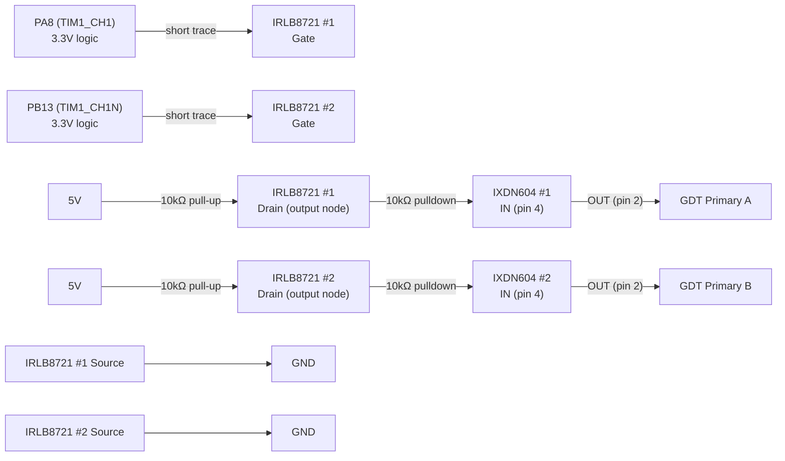
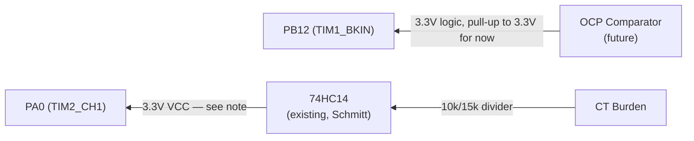
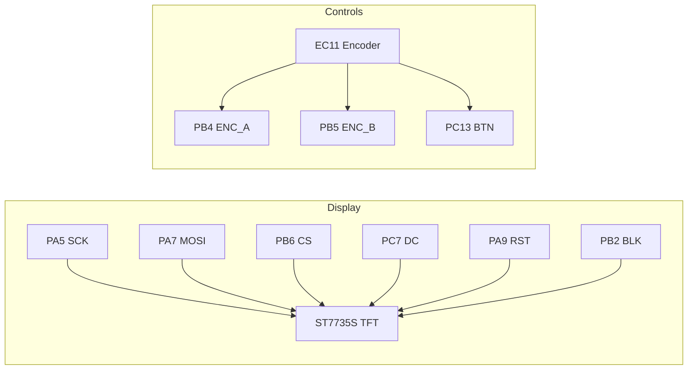
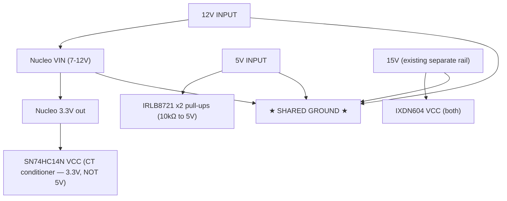

# Board v2 — Direct-to-Morpho Design (supersedes JST harness)

Simplified single-perfboard design. Nucleo sits directly on morpho headers,
all signal traces short. No isolators, no stacked perf, no JST harness.
See `docs/SHIELD_LAYOUT.md` and `docs/JST_CONNECTORS.md` for the deprecated
v1 design and lessons learned (ADuM1201 pinout mismatch, BKIN latch behavior
— still useful background even though the topology changed).

## Why the change

v1 (stacked perf + JST + Si8621 isolators) had long flying leads and
hand-soldered SOIC-8 breakouts — too many failure points, confirmed the hard
way debugging a dead isolator channel. v2 removes both: single board, short
direct traces, isolators dropped (their isolation rationale was already gone
once we went single-star-ground; see below for what replaces their level-shift
function).

---

## PWM Output Path (Nucleo → IRLB8721 level-shift → IXDN604 → GDT)

**FINAL: using IRLB8721 MOSFET level-shifters, not the 74HCT14.** No HCT part
in stock, and the IRLB8721 is a logic-level MOSFET (Vgs-th ~1-2V, drives
cleanly from 3.3V) already in the parts drawer. TO-220 package is also much
easier to hand-solder reliably than another DIP-14 — see the whole isolator
saga this design replaces.

**CT / burden circuit — CONFIRMED, reused from the proven ESP32 build:** work
coil leg → 2kV cap → 40T ferrite toroid CT → 100Ω 100W burden resistor. This
exact combination was battle-tested on the ESP32 version (successfully fed
into its ADC for display) — keep it as-is.

**74HC14 input divider (10kΩ/15kΩ) — NOT YET VERIFIED for this signal path.**
That divider value was carried over from the ESP32's `PIN_VCO_IN` comment,
which scaled a clean CD4046 VCO square wave for a frequency counter — a
different signal than the CT burden's analog sine feeding a Schmitt trigger.
**Do not treat 10k/15k as final.** Once the burden circuit is wired and the
coil is running (even at low bench power), scope the actual burden voltage
on the AD3 and size the divider from that real measurement — same approach
used to calibrate the TIM1 clock constant earlier. The 74HC14 Schmitt
thresholds at 3.3V VCC are VIH≈2.3V / VIL≈1.0V — the divided signal needs to
clear both with margin, without exceeding ~3.8V absolute max on peaks.

**Per-channel circuit (×2, one per PWM signal):**

| MOSFET pin | Connects to |
|-----------|-------------|
| Gate | Nucleo PA8 or PB13 (3.3V logic), directly, short trace |
| Source | Ground |
| Drain | 10kΩ pull-up to 5V **=** the level-shifted output node → to IXDN604 IN |

> **⚠️ THIS CIRCUIT INVERTS THE SIGNAL.** MOSFET off (gate low) → drain pulled
> to 5V (HIGH). MOSFET on (gate high) → drain pulled to GND (LOW). So Nucleo
> LOW → IXDN604 sees HIGH, and Nucleo HIGH → IXDN604 sees LOW.
>
> **Firmware compensates by flipping TIM1 CCER polarity bits** (`CC1P`/`CC1NP`)
> in `PwmDrive::init()` so the Nucleo pins output pre-inverted logic, which
> this circuit un-inverts back to correct polarity at the IXDN604. Complementary
> relationship between the two channels is preserved either way (invert both).
> **TODO: apply this firmware change before first power-up of this path.**
>
> 10kΩ pulldown stays on each IXDN604 input (fail-safe if a MOSFET drain node
> is ever disconnected — pulls IXDN604 input low = gate off, safe default).

**Speed note:** IRLB8721 typical turn-on/off ~2-4ns (fast) but the RC formed
by the 10kΩ pull-up and MOSFET/wiring capacitance dominates actual rise time
— expect tens of ns, similar order to what was measured through the Si8621
in earlier testing. Verify on the AD3 once built; if rise time eats too much
into the 300ns dead-time budget, drop the pull-up to 4.7kΩ or lower (faster
RC, more current draw — fine at this scale).

### Other parts considered, not used

- SN74HCT14N — correct electrical fit (VIH=2.0V fixed) but not in stock
- SN74HC14N (the one in stock) — VIH scales with VCC, marginal at 3.3V input,
  same issue as feeding IXDN604 directly. Not used for this path.
- IRF840 / IRF3710 / generic IRF**N — standard threshold (~4V), won't fully
  turn on from 3.3V gate drive. Not suitable.
- SCT2450KE — SiC power MOSFET, wrong threshold and wildly overkill. Not suitable.
- TL494CN — PWM controller IC, not a level-shifter. Wrong tool for this job.

## Feedback / Fault Path (Power stage → Nucleo)

> **Run the existing 74HC14 (CT frequency conditioner) from 3.3V, not 5V.**
> Its output feeds directly into PA0 — a 5V swing would exceed the Nucleo's
> GPIO absolute max (~VDD+0.3V ≈ 3.6V). At 3.3V VCC, HC14 thresholds become
> VIH≈2.3V / VIL≈1.0V — recheck the CT divider still crosses these cleanly.
> **BKIN (PB12):** until the OCP comparator is built, add a pull-up to
> **3.3V** (not 5V) so it idles safely HIGH (break inactive). When the
> comparator is added, its output must also be 3.3V-logic (or clamped/divided)
> before reaching PB12 — never feed it 5V directly.

## User Interface (unchanged from v1)

## Power Distribution (shared ground, no isolation)

> **12V → Nucleo VIN.** **5V → IRLB8721 pull-up resistors** (this is the only
> thing 5V powers now — the level-shift is passive, not chip-based).
> **Nucleo 3.3V → SN74HC14N VCC** (CT conditioner, must stay off 5V to protect
> PA0). **15V (separate, existing) → IXDN604 VCC.** All sharing one ground.

**Rail summary:**

| Rail | Source | Powers |
|------|--------|--------|
| 12V | Board input | Nucleo VIN |
| 5V | Board input | IRLB8721 x2 pull-up resistors (level-shift reference) |
| 3.3V | Nucleo onboard regulator | SN74HC14N VCC (CT conditioner), pull-ups |
| 15V | Existing separate rail | IXDN604 VCC (gate drive) |

---

## BOM Changes from v1

**Removed:**
- 2x Si8621BB-B-IS + ADuM1201 breakouts
- 2x 8-pin JST connectors + associated wiring
- TVS diodes / Schottky clamps that were part of the isolator input protection

**Added:**
- 2x **IRLB8721** (logic-level N-MOSFET, TO-220) — PWM level-shift, one per
  channel. **In parts drawer, confirmed, no order needed.**
- 2x 10kΩ pull-up resistors (MOSFET drain → 5V, forms the level-shift output)
- 2x 10kΩ pulldown resistors (level-shift output → IXDN604 IN, fail-safe)
- 1x pull-up resistor (10kΩ to 3.3V) on BKIN, temporary until OCP comparator exists

**Unchanged:**
- Existing **SN74HC14N** (TI, genuine, CT frequency conditioner) — reroute its
  VCC from 5V to 3.3V (see feedback path note above)
- IXDN604 x2, GDT, gate resistors/diodes, TFT, encoder, LEDs, NTC

**No longer needed (was going to order, now unnecessary):**
- SN74HCT14N — replaced by the IRLB8721 level-shift circuit

## Physical Layout Notes

- Nucleo morpho headers (CN7/CN10) soldered directly to the new perfboard —
  no cables between Nucleo and driver components
- Keep PA8/PB13 → IRLB8721 gate traces as short as physically possible (this
  was the exact class of problem that caused the v1 debug session)
- IRLB8721s and IXDN604s clustered close together, short traces between them
- TO-220 packages are easy to hand-solder reliably — much less risk than the
  SOIC-8 isolators that caused the v1 rework
- TFT + encoder can stay on longer leads (low-speed, non-critical signals)
- Single ground — no star-point complexity needed for a one-board design,
  just a solid ground plane/bus

## Still TODO on this design

- **Firmware: flip TIM1 CCER polarity bits (`CC1P`/`CC1NP`) in `PwmDrive::init()`**
  to compensate for the IRLB8721 level-shift inversion. Do this BEFORE first
  power-up of this path.
- **Measure actual CT burden voltage on the AD3** with the coil running (low
  power bench test is fine) and size the 74HC14 input divider from that real
  number. The 10k/15k currently in the docs is a carryover from the old
  ESP32 VCO-frequency-counter divider, NOT calculated for this signal — same
  proven CT/burden hardware, different downstream circuit than before.
- Design/wire the OCP comparator (currently just a 3.3V pull-up placeholder
  on BKIN)
- Verify on AD3: rise/fall time through the IRLB8721 level-shift, confirm
  dead-time survives intact (same check as was done for the Si8621 in v1)
