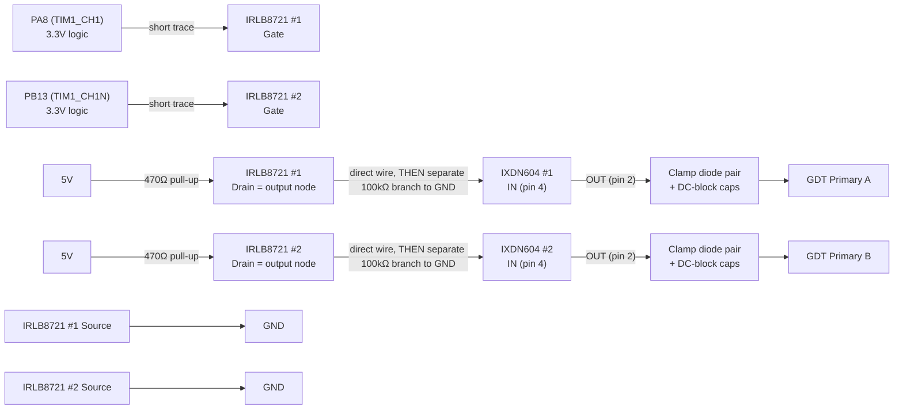
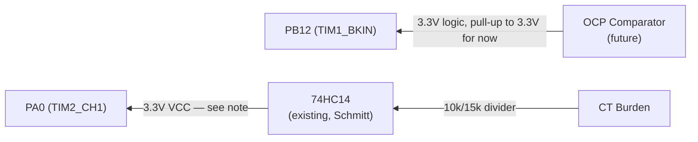
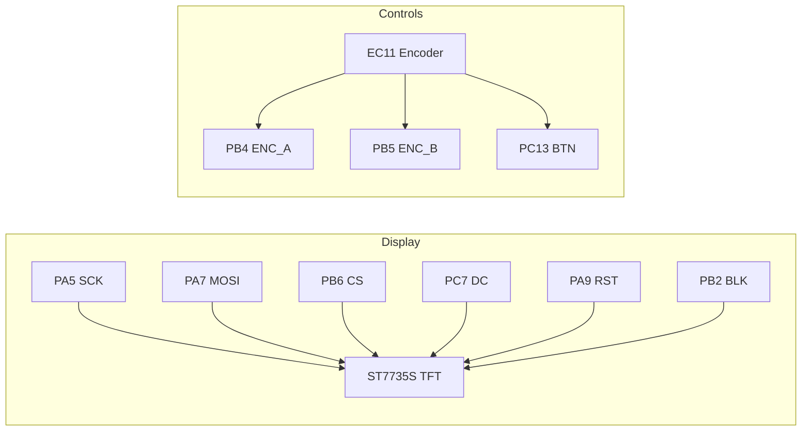
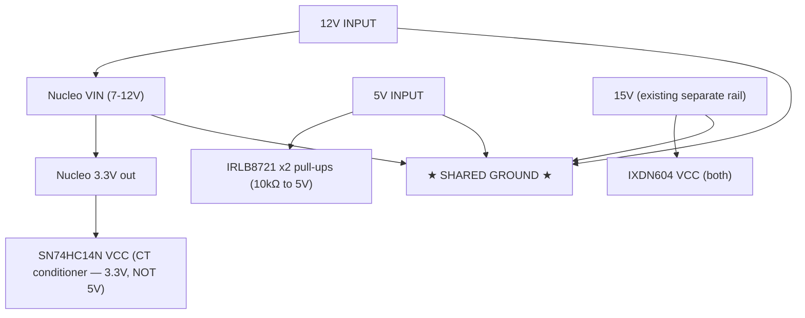

# Board v2 — Direct-to-Morpho Design (supersedes JST harness)

Simplified single-perfboard design. Nucleo sits directly on morpho headers,
all signal traces short. No isolators, no stacked perf, no JST harness.
See `docs/SHIELD_LAYOUT.md` and `docs/JST_CONNECTORS.md` for the deprecated
v1 design and lessons learned (ADuM1201 pinout mismatch, BKIN latch behavior
— still useful background even though the topology changed).

## Why the change

v1 (stacked perf + JST + Si8621 isolators) had long flying leads and
hand-soldered SOIC-8 breakouts — too many failure points, confirmed the hard
way debugging a dead isolator channel. v2 removes both: single board, short
direct traces, isolators dropped (their isolation rationale was already gone
once we went single-star-ground; see below for what replaces their level-shift
function).

---

## PWM Output Path (Nucleo → IRLB8721 level-shift → IXDN604 → GDT)

**FINAL: using IRLB8721 MOSFET level-shifters, not the 74HCT14.** No HCT part
in stock, and the IRLB8721 is a logic-level MOSFET (Vgs-th ~1-2V, drives
cleanly from 3.3V) already in the parts drawer. TO-220 package is also much
easier to hand-solder reliably than another DIP-14 — see the whole isolator
saga this design replaces.



> **RESISTOR VALUES UPDATED (AD3-verified) — pull-up 10kΩ → 470Ω, pulldown
> 10kΩ → 100kΩ.** Bench test with only the 10kΩ pull-up in place showed a
> slow RC-dominated rising edge (3.26µs measured rise time, 63ns fall —
> asymmetric because the MOSFET actively pulls the falling edge but the rising
> edge is passive RC charging through the pull-up). Backing out the time
> constant: RC≈1.48µs at R=10k implies ~148pF of parasitic capacitance on the
> node — higher than expected, most likely the IRLB8721's own Coss (larger
> TO-220 power MOSFETs have more output capacitance than small-signal parts;
> traded off against easy hand-soldering and logic-level gate threshold).
> Lowering the pull-up to 470Ω cuts the rise time to ~155ns (2.2×R×C),
> fitting inside the 300ns dead-time budget. Current draw at 470Ω when the
> MOSFET is ON: 5V/470Ω≈10.6mA per channel — trivial for the 5V/5A supply.
>
> **⚠️ CRITICAL — do not use equal pull-up/pulldown values.** If the pulldown
> at the IXDN604 input were also 10kΩ, it would form a resistive DIVIDER with
> the pull-up (not clean logic levels): 5V×10k/(10k+10k)=2.5V when the MOSFET
> is off — well below the IXDN604's VIH=3.5V, guaranteed to fail. The
> pulldown must be much WEAKER (higher resistance) than the pull-up so it
> barely loads the node in normal operation: at 470Ω pull-up + 100kΩ
> pulldown, the node still reaches ~4.98V (negligible ~1% drop), while still
> providing a defined LOW (gate driver off, safe) if the pull-up/MOSFET path
> is ever disconnected.
>
> **Ringing observed:** 36-38% overshoot and excursions to ~-0.55V on both
> channels during this test — likely LC ringing from the fast (63ns) MOSFET
> turn-off interacting with stray wiring inductance on the current flying
> leads. Watch this once the IXDN604 is wired in (its input loading should
> add damping) and once final board wiring is tightened (shorter leads, less
> loop inductance). If it persists, a small Schottky (e.g. 1N5819) clamped
> from the drain node to GND would tame it — same principle as the GDT
> protection network, just scaled down for this node.

**CT / burden circuit — CONFIRMED, reused from the proven ESP32 build:** work
coil leg → 2kV cap → 40T ferrite toroid CT → 100Ω 100W burden resistor. This
exact combination was battle-tested on the ESP32 version (successfully fed
into its ADC for display) — keep it as-is.

**74HC14 input divider (10kΩ/15kΩ) — NOT YET VERIFIED for this signal path.**
That divider value was carried over from the ESP32's `PIN_VCO_IN` comment,
which scaled a clean CD4046 VCO square wave for a frequency counter — a
different signal than the CT burden's analog sine feeding a Schmitt trigger.
**Do not treat 10k/15k as final.** Once the burden circuit is wired and the
coil is running (even at low bench power), scope the actual burden voltage
on the AD3 and size the divider from that real measurement — same approach
used to calibrate the TIM1 clock constant earlier. The 74HC14 Schmitt
thresholds at 3.3V VCC are VIH≈2.3V / VIL≈1.0V — the divided signal needs to
clear both with margin, without exceeding ~3.8V absolute max on peaks.

**Per-channel circuit (×2, one per PWM signal):**

| MOSFET pin | Connects to |
|-----------|-------------|
| Gate | Nucleo PA8 or PB13 (3.3V logic), directly, short trace |
| Source | Ground |
| Drain | **470Ω** pull-up to 5V **=** the level-shifted output node → direct wire to IXDN604 IN, plus a separate **100kΩ** branch to GND |

> **⚠️ THIS CIRCUIT INVERTS THE SIGNAL.** MOSFET off (gate low) → drain pulled
> to 5V (HIGH). MOSFET on (gate high) → drain pulled to GND (LOW). So Nucleo
> LOW → IXDN604 sees HIGH, and Nucleo HIGH → IXDN604 sees LOW.
>
> **Firmware compensates by flipping TIM1 CCER polarity bits** (`CC1P`/`CC1NP`)
> in `PwmDrive::init()` so the Nucleo pins output pre-inverted logic, which
> this circuit un-inverts back to correct polarity at the IXDN604. Complementary
> relationship between the two channels is preserved either way (invert both).
> **Already applied and verified in firmware.**
>
> **100kΩ pulldown** stays on each IXDN604 input (fail-safe if a MOSFET drain
> node is ever disconnected — pulls IXDN604 input low = gate off, safe
> default). Must be a SEPARATE branch to GND, NOT in series between the
> drain and the IXDN604 input (that miswiring caused a slow RC sawtooth
> during bench test — see resistor-value note above for the full story).

**Speed note — ROUND 2 (AD3-verified, 470Ω, UNLOADED — IXDN604 not yet
wired in, 100kΩ pulldown present, probed at Drain):** rise time improved
from 3.26µs to **325ns**, but that STILL EXCEEDS the 300ns dead-time budget
— the rising channel isn't fully settled before the dead-time gap closes,
which defeats the purpose of the gap. Also observed 16-20% overshoot with
excursions to **-0.39V to -0.43V** on both channels — LC ringing, likely from
parasitic inductance in the current flying-lead wiring interacting with the
MOSFET's switching edge and drain capacitance.

> **Important caveat: this is an UNLOADED measurement.** The IXDN604 was not
> connected. Its input capacitance (typically small, low-pF range) may add
> some damping once wired in, which could reduce the observed overshoot —
> this measurement is likely a worst case, not the final number. Don't
> over-correct (e.g. going straight to very low pull-up values or heavy
> snubbing) based on unloaded data alone. Re-test with the real IXDN604 load
> before adding damping components.

**Next iteration — sequenced (don't jump straight to snubbing):**
1. **Lower pull-up further: try 220Ω** (still unloaded is fine for this
   step). Current draw at 220Ω: 5V/220Ω≈23mA/channel, still trivial. Should
   push rise time further below 300ns.
2. **THEN wire in the real IXDN604** and re-probe at the same point (or its
   IN pin directly) BEFORE adding any damping. Its input capacitance may
   already reduce the ringing seen in the unloaded test — no point adding
   snubbing/clamp components to fix a worst-case number that partially
   self-resolves with the real load present.
3. **Only if ringing is still a problem with the real load:** add a small
   series resistor (10-33Ω) between the MOSFET drain and the
   pull-up/pulldown/IXDN604 node (snubs the ring, small RC cost), or a small
   Schottky (1N5819) clamped from the node to GND (and optionally another to
   5V) — same principle as the proven GDT protection network, scaled down.
4. **Temporary mitigation while tuning:** bump dead-time to 500ns via serial
   (`d500`) for extra margin during resistor-value experimentation; dial
   back down once edges are comfortably fast.

Fall time has stayed consistent (~63-70ns, MOSFET actively driven) across
both resistor values and is not the concern — it's the passive rising edge
and its ringing that need more work.

## GDT Primary Protection Network (carried over from ESP32 build, PROVEN)

**Ran for over a year with zero IXDN losses after implementing this — keep
it, symmetric on BOTH channels this time** (original build had it fuller on
one channel than the other since it mixed IXDI + IXDN; v2 uses IXDN604 on
both, so both get the full network).

The GDT's leakage inductance causes voltage ringing/overshoot on the driver
output pin at each switch transition. Without clamping, this ringing can
exceed the IXDN604's output stage ratings and destroy it — which is exactly
what happened before this network was added. This is a documented, hard-won
fix, not a guess.

```
                      15V
                       │
                     Anode
                    (D_upper)
                     Cathode
                       │
IXDN604 OUT ───────────●─────────┬──────────► GDT Primary
 (pin 2)                │         │
                       Anode    1µF ‖ 1µF
                      (D_lower)  (parallel,
                       Cathode    DC-block)
                       │
                      GND
```

**Per-channel components (×2, one set per IXDN604):**

| Component | Connects to |
|-----------|-------------|
| D_lower (1N5819) | Anode → GND, Cathode → IXDN604 OUT node |
| D_upper (1N5819) | Anode → IXDN604 OUT node, Cathode → 15V |
| 2x 1µF ceramic (parallel) | Between IXDN604 OUT node and GDT primary lead |

**What each part does:**
- **Clamp diode pair** — if the OUT node rings below GND, D_lower conducts
  and clamps it near 0V. If it rings above 15V, D_upper conducts and clamps
  it near 15V. Protects the IXDN604 output stage from destructive overshoot.
- **1µF ‖ 1µF DC-blocking caps** — prevents any DC bias / duty-cycle asymmetry
  from driving a net DC current through the GDT primary (which would walk the
  core toward saturation over time). Two in parallel for lower ESR and higher
  ripple current handling than a single cap. Also has a secondary filtering
  effect on the edge shape seen at the transformer — this was likely what
  gave the "cleaner square wave" result observed during original testing.

**Verification plan:** wire this on both channels as designed. If the AD3
shows signal degradation at the GDT secondary once built, the fix is simple —
bypass the network on one channel at a time (jumper straight from IXDN604 OUT
to the GDT primary lead) and compare. Easy to isolate since each channel has
its own components.

### Other parts considered, not used

- SN74HCT14N — correct electrical fit (VIH=2.0V fixed) but not in stock
- SN74HC14N (the one in stock) — VIH scales with VCC, marginal at 3.3V input,
  same issue as feeding IXDN604 directly. Not used for this path.
- IRF840 / IRF3710 / generic IRF**N — standard threshold (~4V), won't fully
  turn on from 3.3V gate drive. Not suitable.
- SCT2450KE — SiC power MOSFET, wrong threshold and wildly overkill. Not suitable.
- TL494CN — PWM controller IC, not a level-shifter. Wrong tool for this job.

## Feedback / Fault Path (Power stage → Nucleo)



> **Run the existing 74HC14 (CT frequency conditioner) from 3.3V, not 5V.**
> Its output feeds directly into PA0 — a 5V swing would exceed the Nucleo's
> GPIO absolute max (~VDD+0.3V ≈ 3.6V). At 3.3V VCC, HC14 thresholds become
> VIH≈2.3V / VIL≈1.0V — recheck the CT divider still crosses these cleanly.
> **BKIN (PB12):** until the OCP comparator is built, add a pull-up to
> **3.3V** (not 5V) so it idles safely HIGH (break inactive). When the
> comparator is added, its output must also be 3.3V-logic (or clamped/divided)
> before reaching PB12 — never feed it 5V directly.

## User Interface (unchanged from v1)



## Power Distribution (shared ground, no isolation)



> **12V → Nucleo VIN.** **5V → IRLB8721 pull-up resistors** (this is the only
> thing 5V powers now — the level-shift is passive, not chip-based).
> **Nucleo 3.3V → SN74HC14N VCC** (CT conditioner, must stay off 5V to protect
> PA0). **15V (separate, existing) → IXDN604 VCC.** All sharing one ground.

**Rail summary:**

| Rail | Source | Powers |
|------|--------|--------|
| 12V | Board input | Nucleo VIN |
| 5V | Board input | IRLB8721 x2 pull-up resistors (level-shift reference) |
| 3.3V | Nucleo onboard regulator | SN74HC14N VCC (CT conditioner), pull-ups |
| 15V | Existing separate rail | IXDN604 VCC (gate drive) |

---

## BOM Changes from v1

**Removed:**
- 2x Si8621BB-B-IS + ADuM1201 breakouts
- 2x 8-pin JST connectors + associated wiring
- TVS diodes / Schottky clamps that were part of the isolator input protection

**Added:**
- 2x **IRLB8721** (logic-level N-MOSFET, TO-220) — PWM level-shift, one per
  channel. **In parts drawer, confirmed, no order needed.**
- 2x **470Ω** pull-up resistors (MOSFET drain → 5V, forms the level-shift
  output). *AD3-verified value — was 10kΩ, too slow, see notes above.*
- 2x **100kΩ** pulldown resistors (level-shift output → GND, fail-safe branch,
  NOT in series with the IXDN604 input). *Was 10kΩ — would have formed a
  voltage divider with the pull-up and failed to reach IXDN604's VIH.*
- 1x pull-up resistor (10kΩ to 3.3V) on BKIN, temporary until OCP comparator exists

**Unchanged:**
- Existing **SN74HC14N** (TI, genuine, CT frequency conditioner) — reroute its
  VCC from 5V to 3.3V (see feedback path note above)
- IXDN604 x2, GDT, gate resistors/diodes, TFT, encoder, LEDs, NTC
- GDT primary protection network (clamp diodes + DC-block caps) — carried
  over from the proven ESP32 build, now applied symmetrically to BOTH
  channels (see dedicated section above). Need: 4x 1N5819, 4x 1µF ceramic
  (2 per channel).

**No longer needed (was going to order, now unnecessary):**
- SN74HCT14N — replaced by the IRLB8721 level-shift circuit

## Physical Layout Notes

- Nucleo morpho headers (CN7/CN10) soldered directly to the new perfboard —
  no cables between Nucleo and driver components
- Keep PA8/PB13 → IRLB8721 gate traces as short as physically possible (this
  was the exact class of problem that caused the v1 debug session)
- IRLB8721s and IXDN604s clustered close together, short traces between them
- TO-220 packages are easy to hand-solder reliably — much less risk than the
  SOIC-8 isolators that caused the v1 rework
- TFT + encoder can stay on longer leads (low-speed, non-critical signals)
- Single ground — no star-point complexity needed for a one-board design,
  just a solid ground plane/bus

## Still TODO on this design

- **Firmware: flip TIM1 CCER polarity bits (`CC1P`/`CC1NP`) in `PwmDrive::init()`**
  to compensate for the IRLB8721 level-shift inversion. Do this BEFORE first
  power-up of this path.
- **Measure actual CT burden voltage on the AD3** with the coil running (low
  power bench test is fine) and size the 74HC14 input divider from that real
  number. The 10k/15k currently in the docs is a carryover from the old
  ESP32 VCO-frequency-counter divider, NOT calculated for this signal — same
  proven CT/burden hardware, different downstream circuit than before.
- Design/wire the OCP comparator (currently just a 3.3V pull-up placeholder
  on BKIN)
- **Re-verify on AD3 with corrected 470Ω pull-up / 100kΩ pulldown values**
  (first pass with 10kΩ/10kΩ showed a slow RC rise and a miswired series
  pulldown — both diagnosed and fixed in this doc, needs a fresh capture to
  confirm). Check rise/fall time and dead-time survives intact.
- Watch the ~37% overshoot / undershoot-to--0.55V ringing seen in the 10kΩ
  test — may improve once IXDN604 is wired in (adds damping) and wiring is
  tightened. Add a small Schottky clamp to GND on the drain node if it persists.
