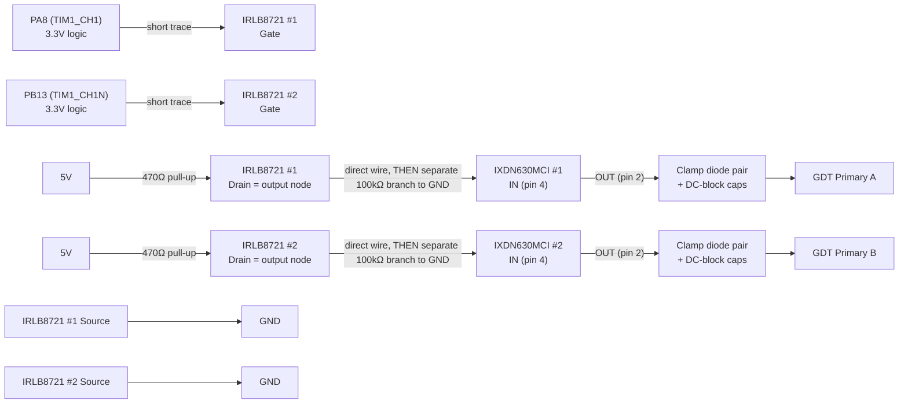
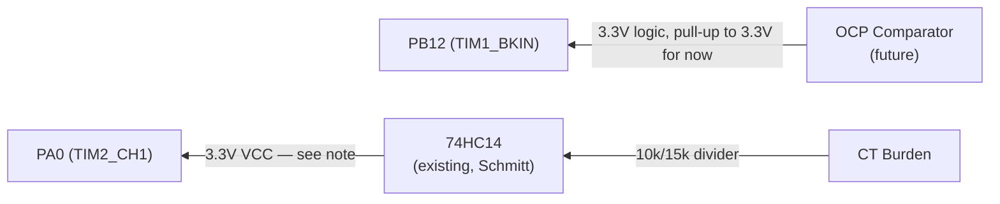
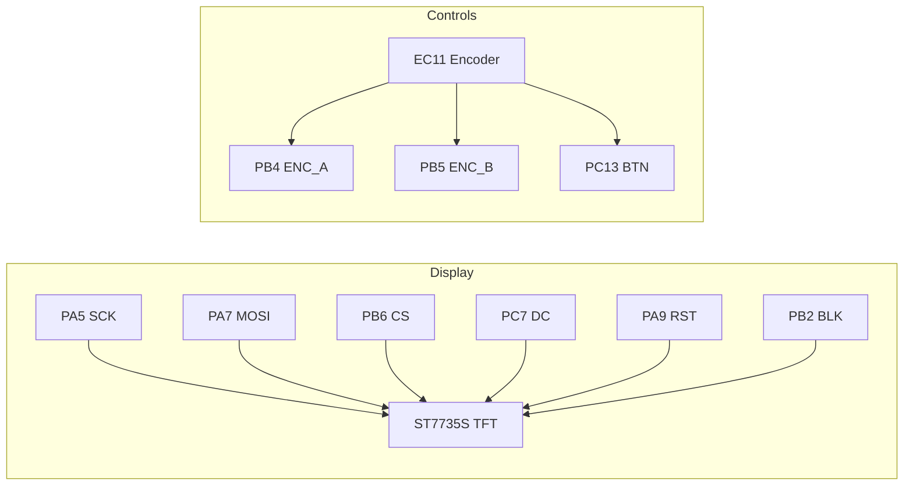
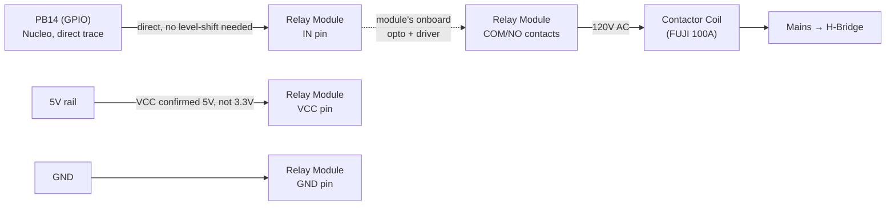
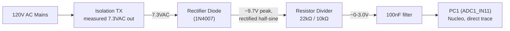

# Board v2 — Direct-to-Morpho Design (supersedes JST harness)

Simplified single-perfboard design. Nucleo sits directly on morpho headers,
all signal traces short. No isolators, no stacked perf, no JST harness.
See `docs/SHIELD_LAYOUT.md` and `docs/JST_CONNECTORS.md` for the deprecated
v1 design and lessons learned (ADuM1201 pinout mismatch, BKIN latch behavior
— still useful background even though the topology changed).

## Why the change

v1 (stacked perf + JST + Si8621 isolators) had long flying leads and
hand-soldered SOIC-8 breakouts — too many failure points, confirmed the hard
way debugging a dead isolator channel. v2 removes both: single board, short
direct traces, isolators dropped (their isolation rationale was already gone
once we went single-star-ground; see below for what replaces their level-shift
function).

---

## PWM Output Path (Nucleo → IRLB8721 level-shift → IXDN630MCI → GDT)

**FINAL: using IRLB8721 MOSFET level-shifters, not the 74HCT14.** No HCT part
in stock, and the IRLB8721 is a logic-level MOSFET (Vgs-th ~1-2V, drives
cleanly from 3.3V) already in the parts drawer. TO-220 package is also much
easier to hand-solder reliably than another DIP-14 — see the whole isolator
saga this design replaces.



> **RESISTOR VALUES UPDATED (AD3-verified) — pull-up 10kΩ → 470Ω, pulldown
> 10kΩ → 100kΩ.** Bench test with only the 10kΩ pull-up in place showed a
> slow RC-dominated rising edge (3.26µs measured rise time, 63ns fall —
> asymmetric because the MOSFET actively pulls the falling edge but the rising
> edge is passive RC charging through the pull-up). Backing out the time
> constant: RC≈1.48µs at R=10k implies ~148pF of parasitic capacitance on the
> node — higher than expected, most likely the IRLB8721's own Coss (larger
> TO-220 power MOSFETs have more output capacitance than small-signal parts;
> traded off against easy hand-soldering and logic-level gate threshold).
> Lowering the pull-up to 470Ω cuts the rise time to ~155ns (2.2×R×C),
> fitting inside the 300ns dead-time budget. Current draw at 470Ω when the
> MOSFET is ON: 5V/470Ω≈10.6mA per channel — trivial for the 5V/5A supply.
>
> **⚠️ CRITICAL — do not use equal pull-up/pulldown values.** If the pulldown
> at the IXDN630MCI input were also 10kΩ, it would form a resistive DIVIDER with
> the pull-up (not clean logic levels): 5V×10k/(10k+10k)=2.5V when the MOSFET
> is off — well below the IXDN630MCI's VIH=3.5V, guaranteed to fail. The
> pulldown must be much WEAKER (higher resistance) than the pull-up so it
> barely loads the node in normal operation: at 470Ω pull-up + 100kΩ
> pulldown, the node still reaches ~4.98V (negligible ~1% drop), while still
> providing a defined LOW (gate driver off, safe) if the pull-up/MOSFET path
> is ever disconnected.
>
> **Ringing observed:** 36-38% overshoot and excursions to ~-0.55V on both
> channels during this test — likely LC ringing from the fast (63ns) MOSFET
> turn-off interacting with stray wiring inductance on the current flying
> leads. Watch this once the IXDN630MCI is wired in (its input loading should
> add damping) and once final board wiring is tightened (shorter leads, less
> loop inductance). If it persists, a small Schottky (e.g. 1N5819) clamped
> from the drain node to GND would tame it — same principle as the GDT
> protection network, just scaled down for this node.

**CT / burden circuit — CONFIRMED, reused from the proven ESP32 build:** work
coil leg → 2kV cap → 40T ferrite toroid CT → 100Ω 100W burden resistor. This
exact combination was battle-tested on the ESP32 version (successfully fed
into its ADC for display) — keep it as-is.

**74HC14 input divider (10kΩ/15kΩ) — NOT YET VERIFIED for this signal path.**
That divider value was carried over from the ESP32's `PIN_VCO_IN` comment,
which scaled a clean CD4046 VCO square wave for a frequency counter — a
different signal than the CT burden's analog sine feeding a Schmitt trigger.
**Do not treat 10k/15k as final.** Once the burden circuit is wired and the
coil is running (even at low bench power), scope the actual burden voltage
on the AD3 and size the divider from that real measurement — same approach
used to calibrate the TIM1 clock constant earlier. The 74HC14 Schmitt
thresholds at 3.3V VCC are VIH≈2.3V / VIL≈1.0V — the divided signal needs to
clear both with margin, without exceeding ~3.8V absolute max on peaks.

**Per-channel circuit (×2, one per PWM signal):**

| MOSFET pin | Connects to |
|-----------|-------------|
| Gate | Nucleo PA8 or PB13 (3.3V logic), directly, short trace |
| Source | Ground |
| Drain | **470Ω** pull-up to 5V **=** the level-shifted output node → direct wire to IXDN630MCI IN, plus a separate **100kΩ** branch to GND |

> **⚠️ THIS CIRCUIT INVERTS THE SIGNAL.** MOSFET off (gate low) → drain pulled
> to 5V (HIGH). MOSFET on (gate high) → drain pulled to GND (LOW). So Nucleo
> LOW → IXDN630MCI sees HIGH, and Nucleo HIGH → IXDN630MCI sees LOW.
>
> **Firmware compensates by flipping TIM1 CCER polarity bits** (`CC1P`/`CC1NP`)
> in `PwmDrive::init()` so the Nucleo pins output pre-inverted logic, which
> this circuit un-inverts back to correct polarity at the IXDN630MCI. Complementary
> relationship between the two channels is preserved either way (invert both).
> **Already applied and verified in firmware.**
>
> **100kΩ pulldown** stays on each IXDN630MCI input (fail-safe if a MOSFET drain
> node is ever disconnected — pulls IXDN630MCI input low = gate off, safe
> default). Must be a SEPARATE branch to GND, NOT in series between the
> drain and the IXDN630MCI input (that miswiring caused a slow RC sawtooth
> during bench test — see resistor-value note above for the full story).

**Speed note — ROUND 2 (AD3-verified, 470Ω, UNLOADED — IXDN630MCI not yet
wired in, 100kΩ pulldown present, probed at Drain):** rise time improved
from 3.26µs to **325ns**, but that STILL EXCEEDS the 300ns dead-time budget
— the rising channel isn't fully settled before the dead-time gap closes,
which defeats the purpose of the gap. Also observed 16-20% overshoot with
excursions to **-0.39V to -0.43V** on both channels — LC ringing, likely from
parasitic inductance in the current flying-lead wiring interacting with the
MOSFET's switching edge and drain capacitance.

> **Important caveat: this is an UNLOADED measurement.** The IXDN630MCI was not
> connected. Its input capacitance (typically small, low-pF range) may add
> some damping once wired in, which could reduce the observed overshoot —
> this measurement is likely a worst case, not the final number. Don't
> over-correct (e.g. going straight to very low pull-up values or heavy
> snubbing) based on unloaded data alone. Re-test with the real IXDN630MCI load
> before adding damping components.

**Next iteration — sequenced (don't jump straight to snubbing):**
1. **Lower pull-up further: try 220Ω** (still unloaded is fine for this
   step). Current draw at 220Ω: 5V/220Ω≈23mA/channel, still trivial. Should
   push rise time further below 300ns.
2. **THEN wire in the real IXDN630MCI** and re-probe at the same point (or its
   IN pin directly) BEFORE adding any damping. Its input capacitance may
   already reduce the ringing seen in the unloaded test — no point adding
   snubbing/clamp components to fix a worst-case number that partially
   self-resolves with the real load present.
3. **Only if ringing is still a problem with the real load:** add a small
   series resistor (10-33Ω) between the MOSFET drain and the
   pull-up/pulldown/IXDN630MCI node (snubs the ring, small RC cost), or a small
   Schottky (1N5819) clamped from the node to GND (and optionally another to
   5V) — same principle as the proven GDT protection network, scaled down.
4. **Temporary mitigation while tuning:** bump dead-time to 500ns via serial
   (`d500`) for extra margin during resistor-value experimentation; dial
   back down once edges are comfortably fast.

Fall time has stayed consistent (~63-70ns, MOSFET actively driven) across
both resistor values and is not the concern — it's the passive rising edge
and its ringing that need more work.

## GDT Primary Protection Network (carried over from ESP32 build, PROVEN)

**Ran for over a year with zero IXDN losses after implementing this — keep
it, symmetric on BOTH channels this time** (original build had it fuller on
one channel than the other since it mixed IXDI + IXDN; v2 uses IXDN630MCI on
both, so both get the full network).

The GDT's leakage inductance causes voltage ringing/overshoot on the driver
output pin at each switch transition. Without clamping, this ringing can
exceed the IXDN630MCI's output stage ratings and destroy it — which is exactly
what happened before this network was added. This is a documented, hard-won
fix, not a guess.

```
                      15V
                       │
                     Anode
                    (D_upper)
                     Cathode
                       │
IXDN630MCI OUT ───────────●─────────┬──────────► GDT Primary
 (pin 2)                │         │
                       Anode    1µF ‖ 1µF
                      (D_lower)  (parallel,
                       Cathode    DC-block)
                       │
                      GND
```

**Per-channel components (×2, one set per IXDN630MCI):**

| Component | Connects to |
|-----------|-------------|
| D_lower (1N5819) | Anode → GND, Cathode → IXDN630MCI OUT node |
| D_upper (1N5819) | Anode → IXDN630MCI OUT node, Cathode → 15V |
| 2x 1µF ceramic (parallel) | Between IXDN630MCI OUT node and GDT primary lead |

**What each part does:**
- **Clamp diode pair** — if the OUT node rings below GND, D_lower conducts
  and clamps it near 0V. If it rings above 15V, D_upper conducts and clamps
  it near 15V. Protects the IXDN630MCI output stage from destructive overshoot.
- **1µF ‖ 1µF DC-blocking caps** — prevents any DC bias / duty-cycle asymmetry
  from driving a net DC current through the GDT primary (which would walk the
  core toward saturation over time). Two in parallel for lower ESR and higher
  ripple current handling than a single cap. Also has a secondary filtering
  effect on the edge shape seen at the transformer — this was likely what
  gave the "cleaner square wave" result observed during original testing.

**Verification plan:** wire this on both channels as designed. If the AD3
shows signal degradation at the GDT secondary once built, the fix is simple —
bypass the network on one channel at a time (jumper straight from IXDN630MCI OUT
to the GDT primary lead) and compare. Easy to isolate since each channel has
its own components.

### Other parts considered, not used

- SN74HCT14N — correct electrical fit (VIH=2.0V fixed) but not in stock
- SN74HC14N (the one in stock) — VIH scales with VCC, marginal at 3.3V input,
  same issue as feeding IXDN630MCI directly. Not used for this path.
- IRF840 / IRF3710 / generic IRF**N — standard threshold (~4V), won't fully
  turn on from 3.3V gate drive. Not suitable.
- SCT2450KE — SiC power MOSFET, wrong threshold and wildly overkill. Not suitable.
- TL494CN — PWM controller IC, not a level-shifter. Wrong tool for this job.

## Feedback / Fault Path (Power stage → Nucleo)



> **Run the existing 74HC14 (CT frequency conditioner) from 3.3V, not 5V.**
> Its output feeds directly into PA0 — a 5V swing would exceed the Nucleo's
> GPIO absolute max (~VDD+0.3V ≈ 3.6V). At 3.3V VCC, HC14 thresholds become
> VIH≈2.3V / VIL≈1.0V — recheck the CT divider still crosses these cleanly.
> **BKIN (PB12):** until the OCP comparator is built, add a pull-up to
> **3.3V** (not 5V) so it idles safely HIGH (break inactive). When the
> comparator is added, its output must also be 3.3V-logic (or clamped/divided)
> before reaching PB12 — never feed it 5V directly.

## User Interface (unchanged from v1)



## Power Distribution (shared ground, no isolation)


> **12V → Nucleo VIN.** **5V → IRLB8721 pull-up resistors** (this is the only
> thing 5V powers now — the level-shift is passive, not chip-based).
> **Nucleo 3.3V → SN74HC14N VCC** (CT conditioner, must stay off 5V to protect
> PA0). **15V (separate, existing) → IXDN630MCI VCC.** All sharing one ground.

**Rail summary:**

| Rail | Source | Powers |
|------|--------|--------|
| 12V | Board input | Nucleo VIN |
| 5V | Board input | IRLB8721 x2 pull-up resistors (level-shift reference) |
| 3.3V | Nucleo onboard regulator | SN74HC14N VCC (CT conditioner), pull-ups |
| 15V | Existing separate rail | IXDN630MCI VCC (gate drive) |

---

## BOM Changes from v1

**Removed:**
- 2x Si8621BB-B-IS + ADuM1201 breakouts
- 2x 8-pin JST connectors + associated wiring
- TVS diodes / Schottky clamps that were part of the isolator input protection

**Added:**
- 2x **IRLB8721** (logic-level N-MOSFET, TO-220) — PWM level-shift, one per
  channel. **In parts drawer, confirmed, no order needed.**
- 2x **470Ω** pull-up resistors (MOSFET drain → 5V, forms the level-shift
  output). *AD3-verified value — was 10kΩ, too slow, see notes above.*
- 2x **100kΩ** pulldown resistors (level-shift output → GND, fail-safe branch,
  NOT in series with the IXDN630MCI input). *Was 10kΩ — would have formed a
  voltage divider with the pull-up and failed to reach IXDN630MCI's VIH.*
- 1x pull-up resistor (10kΩ to 3.3V) on BKIN, temporary until OCP comparator exists

**Unchanged:**
- Existing **SN74HC14N** (TI, genuine, CT frequency conditioner) — reroute its
  VCC from 5V to 3.3V (see feedback path note above)
- IXDN630MCI x2, GDT, gate resistors/diodes, TFT, encoder, LEDs, NTC
- GDT primary protection network (clamp diodes + DC-block caps) — carried
  over from the proven ESP32 build, now applied symmetrically to BOTH
  channels (see dedicated section above). Need: 4x 1N5819, 4x 1µF ceramic
  (2 per channel).

**No longer needed (was going to order, now unnecessary):**
- SN74HCT14N — replaced by the IRLB8721 level-shift circuit

## Physical Layout Notes

- Nucleo morpho headers (CN7/CN10) soldered directly to the new perfboard —
  no cables between Nucleo and driver components
- Keep PA8/PB13 → IRLB8721 gate traces as short as physically possible (this
  was the exact class of problem that caused the v1 debug session)
- IRLB8721s and IXDN630MCIs clustered close together, short traces between them
- TO-220 packages are easy to hand-solder reliably — much less risk than the
  SOIC-8 isolators that caused the v1 rework
- TFT + encoder can stay on longer leads (low-speed, non-critical signals)
- Single ground — no star-point complexity needed for a one-board design,
  just a solid ground plane/bus

## Still TODO on this design

- **Firmware: flip TIM1 CCER polarity bits (`CC1P`/`CC1NP`) in `PwmDrive::init()`**
  to compensate for the IRLB8721 level-shift inversion. Do this BEFORE first
  power-up of this path.
- **Measure actual CT burden voltage on the AD3** with the coil running (low
  power bench test is fine) and size the 74HC14 input divider from that real
  number. The 10k/15k currently in the docs is a carryover from the old
  ESP32 VCO-frequency-counter divider, NOT calculated for this signal — same
  proven CT/burden hardware, different downstream circuit than before.
- Design/wire the OCP comparator (currently just a 3.3V pull-up placeholder
  on BKIN)
- **Re-verify on AD3 with corrected 470Ω pull-up / 100kΩ pulldown values**
  (first pass with 10kΩ/10kΩ showed a slow RC rise and a miswired series
  pulldown — both diagnosed and fixed in this doc, needs a fresh capture to
  confirm). Check rise/fall time and dead-time survives intact.
- Watch the ~37% overshoot / undershoot-to--0.55V ringing seen in the 10kΩ
  test — may improve once IXDN630MCI is wired in (adds damping) and wiring is
  tightened. Add a small Schottky clamp to GND on the drain node if it persists.

## Post-mortem: AD3 Channel 2 false ringing (RESOLVED — instrument, not circuit)

After the full IXDN630MCI array was wired (clamp diodes + DC-block caps on
both channels, per the protection network above), initial probing showed
severe, consistent asymmetry: Channel 1 read ~10-20% overshoot, Channel 2
read 75-165% overshoot, across THREE different load resistors (22Ω, ~10Ω,
~470Ω-parallel). The ratio held steady regardless of load, which was the key
clue pointing away from a real load-dependent resonance.

**Diagnostic sequence that found it:**
1. Verified board wiring, diode orientation, solder joints — all clean.
2. Tied both probe grounds directly at the IXDN pin instead of a shared
   distant Nucleo GND — reduced C1 slightly, C2 barely changed. Ruled out
   ground-lead inductance as the primary cause.
3. **Physically swapped the two probes between the channels** (same test,
   same load) — the bad reading STAYED on scope Channel 2, even though it
   was now connected to the physical node that had previously read clean.
   This conclusively proved the fault was in the instrument/probe, not the
   board (a real circuit fault would have followed the physical node, not
   the scope channel).
4. Swapped in a different physical probe on Channel 2 — overshoot dropped
   from 100%+ to 6.67%, matching Channel 1's clean behavior.
5. **Confirmed on a bench oscilloscope: perfect square wave, no ringing.**

**Root cause: the AD3's Channel 2 probe/cable (or its compensation) was
producing false ringing on fast edges (~28-30ns rise time).** The circuit —
IRLB8721 level-shift, IXDN630MCI drive, GDT protection network — was correct
the entire time. No hardware changes were needed.

**Lesson for future AD3 use on this project:** when chasing an asymmetric
or unexpected reading between channels, swap probes between channels EARLY
in the diagnostic sequence (before extensive board rework) to rule out
instrumentation. A real circuit fault follows the physical node when probes
are swapped; an instrument fault follows the scope channel. Cross-check
against a bench scope if available and results still don't make sense.

---

## ⚠️ OPEN ISSUES — RESUME HERE

Two unresolved threads from the AC-sense wiring session. Do NOT reconnect
PC1 to the AC-sense divider, and treat the NTC reading with suspicion,
until both are resolved.

### Issue 1 — AC-sense divider resistor value (in progress)

Resized twice (27k→22k→8.2k), see the divider note above for full history.
**Next step:** swap in the 8.2kΩ resistor, re-verify on the AD3 that the
divider midpoint peaks near 3.0V with the full circuit (TX+rectifier+
divider+filter) connected. Do not reconnect to PC1 until confirmed.

### Issue 2 — PC1 overvoltage exposure (unresolved — safety relevant)

PC1 was briefly connected to the AC-sense divider while it was still
producing a 5.5V peak (before the mismatch was caught) — above the
STM32F446RE's standard I/O absolute max (~3.6V). Could not conclusively
verify from datasheet lookups whether PC1 specifically is a 5V-tolerant
(FT) pin (some STM32F4 pins are FT, up to 4.0V abs max; not confirmed
whether PC1 is one). Disconnected once discovered; not appearing to be
outright dead, but NOT fully cleared either.

**What was checked so far:** display, LEDs, encoder, general board
function all seem OK by inspection. NTC (PC0, same ADC1 peripheral)
is behaving anomalously (see Issue 3) but causation vs. coincidence with
the PC1 event is NOT established.

**Still TODO to fully clear this:**
- Multimeter continuity/leakage check on PC1 (Nucleo powered OFF): measure
  resistance PC1-to-GND and PC1-to-3.3V, compare to a known-good pin as a
  baseline if possible.
- Once the divider is fixed at 8.2kΩ and AD3-verified safe (~3V peak),
  reconnect PC1 and watch `Sensing::readAcRaw()` / the "MAINS" display field
  over time — confirm it tracks the AC waveform's zero-crossings sensibly
  rather than reading garbage or pegging at max.
- Do not consider this resolved until both of the above look clean.

### Issue 3 — NTC reading anomaly (unresolved, in-progress diagnostic)

NTC clamped to a soldering iron handle read ~41-46°C over several minutes
(handle independently measured at 30°C via IR thermometer — consistent,
so NOT a sensor-to-object contact issue). **Unclamped in free air for a
couple minutes, the reading is SLOWLY RISING instead of falling toward the
~27.8°C room temp (82°F on the thermostat) — backwards from expected
physics.** This is a real anomaly, not just thermal lag/smoothing.

**Diagnostic in progress, next step when resuming:** measure DC voltage
directly at the NTC divider midpoint (the node feeding PC0) with a
multimeter, independent of the Nucleo/firmware. Calculated expected value
at 27.8°C ambient (R_fixed=10k, R0=10k@25°C, Beta=3435): **≈1.56V**.

- If multimeter reads close to ~1.56V → the analog NTC circuit itself is
  fine; the fault would be downstream (ADC reading, firmware conversion,
  or possibly the ADC1 peripheral affected by the PC1 overvoltage event
  since PC0 and PC1 share ADC1 — this would tie Issues 2 and 3 together).
- If multimeter reads notably different from ~1.56V → the analog circuit
  itself has a fault (solder joint, wrong resistor, damaged NTC lead from
  handling during this session) — unrelated to the PC1 incident.

**This measurement was not yet taken when the session paused — it's the
very next thing to do when resuming this thread.**

---

## HV Side — Contactor Control & AC Sensing (v2, direct wiring)

Adapted from `docs/MAINS_CONTROL.md` (v1) for the Board v2 architecture:
no JST harness, no Si8621 isolators — direct wiring on one perf, single
shared ground throughout. This section is the authoritative wiring for
the mains control portion of Board v2.

### System path

```
AC Mains → EMI Filter → Contactor → Rectifier → DC Bus → H-Bridge
```

The EMI filter (YS36Q1AN-50A type, on order, ETA Sept 8) is a chassis-mount
part, not on this board — see `MAINS_CONTROL.md` for its placement and the
mandatory earth-bond requirement. Everything below IS on Board v2.

### Contactor control — using an all-in-one relay module

**CORRECTION: using a pre-built relay module board, not discrete opto + diode
+ relay.** These common modules (e.g. Songle SRD-05VDC based) already
integrate the optocoupler, flyback diode, driver transistor, status LED, and
sometimes an onboard regulator. Just 4 pins to interface with: **VCC, GND, IN,
and the relay contacts (COM/NO/NC).** Much simpler wiring than the discrete
version — the module does all of it internally.



| Relay module pin | Connects to |
|-------------------|-------------|
| VCC | 5V rail |
| GND | GND (shared board ground) |
| IN | PB14 (Nucleo), direct trace |
| COM | 120V AC hot (mains side) |
| NO (normally open) | Contactor coil (+) — closes when PB14 drives the module active |

> **IDENTIFIED: Teyleten Robot "1 Channel Optocoupler 3V/3.3V Relay HIGH
> LEVEL Driver Module"** (Amazon B07XGZSYJV). Confirmed **active-HIGH**
> from the product name/spec ("High Level Driver" — distinguishes it from
> the low-level/active-LOW sibling variant sold under the same style).
> **Matches the current firmware exactly** — `MainsControl::energize()`
> drives PB14 HIGH to energize, `deEnergize()` drives LOW. No firmware
> changes needed.
>
> **VCC RESOLVED: use 5V, not 3.3V.** User reviews on this module confirm
> the IN pin works directly from 3.3V logic (ESP32/STM32) with no extra
> circuitry, but the module runs more reliably ("happier") on 5V VCC for the
> relay coil driver side. Since the board already has a 5V rail for other
> purposes, power VCC from that — costs nothing extra and gives the relay a
> fuller, more reliable pull-in than running the coil driver at 3.3V.
>
> **Final pin-out: VCC → 5V rail, GND → shared ground, IN → PB14 direct
> (3.3V, no level-shift needed), COM/NO → 120V AC to contactor coil.**
>
> No JST or isolator needed here — PB14 wires directly to the module's IN pin
> on the same board. The module's onboard optocoupler still provides the
> logic-to-relay-coil isolation boundary, which is the important one (not
> board-to-board isolation, which v2 dropped in favor of single-ground
> simplicity).

### AC sensing (zero-cross / mains presence)



| Component | Wiring |
|-----------|--------|
| Isolation TX secondary | → 1N4007 anode (measured 7.3VAC unloaded, not the 12V nameplate) |
| 1N4007 cathode | → divider node (22kΩ top leg) |
| Divider: 22kΩ | Top leg, from rectifier cathode to divider midpoint |
| Divider: 10kΩ | Bottom leg, from divider midpoint to GND |
| Divider midpoint | → 100nF to GND (filter), → PC1 direct trace |

> **No smoothing cap on the rectifier output** — the ADC needs to see the
> rectified half-sine wave (dips near 0V twice per AC cycle) to detect
> zero-crossings. Only the small 100nF filter cap is present, sized to knock
> down HF noise without flattening the 120Hz envelope.
>
> **DIVIDER — SECOND CORRECTION NEEDED, 22kΩ still too low a ratio.**
> First pass used 27kΩ (from `MAINS_CONTROL.md`, too high a ratio → 5.4V
> peak p-p seen at midpoint, exceeded target). Recalculated to 22kΩ using
> the measured 7.3VAC TX output, but AD3 testing with the FULL circuit
> (TX + rectifier + 22kΩ/10kΩ divider + 100nF filter) still measured
> **Maximum 5.5V, Peak2Peak 5.41V** at the divider midpoint — higher than
> the ~3.0V target, and confirmed independently via multimeter DC average
> (2.392V, consistent with a half-wave-rectified 60Hz waveform peaking
> near 5.5V). The hand-calculation from 7.3VAC did not match the measured
> in-circuit peak — likely the TX output sags/rises differently once loaded
> by the actual rectifier+divider vs. the open-circuit multimeter reading.
>
> **Resized directly from the AD3-confirmed real peak (5.5V) instead of
> back-calculating from TX voltage:**
> - Target ~3.0V at the ADC: `3.0 / 5.5 ≈ 0.545` ratio
> - With R_bottom=10kΩ fixed: `R_top ≈ 8.2kΩ` (was 22kΩ, now 8.2kΩ)
> - Check: `5.5V × 10k/(8.2k+10k) ≈ 3.02V` — good margin under 3.6V max
>
> **⚠️ NOT YET RE-VERIFIED ON AD3 with the 8.2kΩ value in place.** Given two
> rounds of the hand-calculated value not matching the measured in-circuit
> result, do NOT trust 8.2kΩ as final without a fresh AD3 capture after
> swapping the resistor. This is the next step when resuming.
>
> **⚠️ SAFETY NOTE — PC1 exposure incident:** PC1 was connected to this
> divider (5.5V peak) before the mismatch was caught, then disconnected.
> Not yet 100% confirmed whether this caused any damage — see "PC1
> overvoltage exposure" note below. Do NOT reconnect PC1 to this divider
> until the 8.2kΩ swap is verified safe on the AD3 first.

### Pin assignments (v2, direct traces — no JST)

| Function | Nucleo Pin | Morpho | Direct trace to |
|----------|-----------|--------|------------------|
| Contactor control | PB14 | CN10-28 | Optocoupler LED (330Ω in series) |
| AC sense | PC1 (ADC1_IN11) | CN7-36 | Divider midpoint (100nF filter) |

> PA4 is ADC_VBUS (bus voltage) — do NOT confuse with AC sense (PC1). Matches
> `PIN_ADC_AC` in `config.h`.

### BOM additions for this section

| Qty | Part | Value/Type | Notes |
|-----|------|-----------|-------|
| 1 | Relay module | Teyleten 1-Channel Opto 3V/3.3V Relay "High Level Driver" (Amazon B07XGZSYJV) | VCC/GND/IN/COM/NO pins. Confirmed active-HIGH, 3.3V logic native — matches firmware and Nucleo I/O directly. |
| 1 | Isolation transformer | 120V:12V, 1-5W | Chassis or PCB mount for AC sense |
| 1 | Diode | 1N4007 | Rectifies TX secondary |
| 1 | Resistor | **8.2kΩ** 1/4W | Divider upper leg — 3rd value (27k→22k→8.2k), resized from AD3-measured real peak (5.5V), NOT YET RE-VERIFIED |
| 1 | Resistor | 10kΩ 1/4W | Divider lower leg — unchanged throughout |
| 1 | Capacitor | 100nF ceramic | Filter on ADC input, NOT a smoothing cap |
| 1 | Illuminated toggle switch | 250V/125V dual-rated, 15A/20A | Manual 110V master control, gates TX primary + relay COM branches — panel mount |

### Startup / shutdown sequence (unchanged logic, v2 wiring)

**Startup:**
1. Verify NTC temperature below `TEMP_SHUTDOWN_C`
2. Verify mains presence (AC sense ADC reading above `AC_PRESENT_THRESHOLD`)
3. Optionally wait for zero-crossing (reduces contactor inrush/arcing)
4. Drive PB14 HIGH → opto → relay → contactor energizes
5. Wait for DC bus charge (`BUS_CHARGE_MS`)
6. Enable PWM (TIM1 outputs active)

**Shutdown (fastest first):**
1. Kill PWM — TIM1 BKIN hardware break (~6ns) or firmware `disableOutputs()`
2. Drop contactor — PB14 LOW → opto off → relay off → contactor drops
3. Log fault reason (OCP/temp/mains/manual) for display

This logic is already implemented in `StateManager.cpp` / `MainsControl.cpp`
from the firmware scaffold — no firmware changes needed, just the physical
wiring described above.

### Manual 110V master toggle (added — bench safety + sequencing)

An illuminated toggle switch (250V/125V dual-rated, 15A/20A) sits at the
very front of the 110V control circuit, gating BOTH branches below it:

```
110V AC ── [Illuminated toggle, 15/20A] ──┬── Isolation TX primary (AC sense, ~1-5W)
                                            └── Relay module COM (→ NO → contactor COIL)

240V AC (via Variac, 0V at startup)
    → Contactor MAIN CONTACTS (50A, completely separate from the coil circuit above)
    → Rectifier brick (100A) → IGBT H-bridge high side
```

**Why the switch rating is more than sufficient, permanently:** the
contactor's coil-control circuit (110V) is structurally isolated from the
240V/50A power rail by design — the variac and rectifier brick only ever
touch the 240V side. The toggle only ever carries the TX's few watts and the
contactor coil's small fixed current. This never changes regardless of how
much power the induction heater eventually draws — the switch does not need
upgrading before full-power runs.

**Sequencing this enables (matches the intended bring-up procedure):**
1. Power the Nucleo (USB/12V) with the toggle OFF — verify GPIOs, TFT,
   encoder, sensing with zero HV present anywhere on the board.
2. Flip the toggle ON — 110V now live to the TX (Nucleo can detect
   `mainsPresent()`) and to the relay module's COM. Contactor's main
   contacts stay open (no HV to IGBTs yet) since the relay hasn't fired.
3. Button press → firmware energizes the relay → contactor closes → 240V
   (still at 0V from the variac at this point) reaches the rectifier/IGBTs.
4. Bring the variac up gradually, as always.

This gives a visible, physically-switched way to kill all control power
before touching anything, independent of firmware state — a genuine manual
safety layer on top of the software startup/shutdown sequencing.

### Physical layout notes

- Relay, optocoupler, flyback diode: same board, share the single ground
  with everything else (no separate isolated ground domain in v2)
- 120V wiring to/from the relay contacts: proper gauge wire, physically
  separated from low-voltage traces on the board
- Isolation TX can be chassis-mounted off-board with wires to the perf if it
  doesn't fit the footprint
- Contactor coil wires: spade or screw terminals, not soldered joints (the
  contactor vibrates when energized)
- The illuminated toggle switch can be panel/enclosure mounted (not on the
  perf itself) — it's a manual front-panel control, wired in series ahead of
  the TX primary and relay COM branches

### Still TODO on this section

- ✅ **Relay module polarity RESOLVED** — identified as Teyleten "3V/3.3V
  Relay High Level Driver Module" (Amazon B07XGZSYJV), confirmed active-HIGH,
  matches firmware as-is. No changes needed.
- ✅ **VCC voltage RESOLVED** — use 5V (not 3.3V). User reviews confirm IN
  works from 3.3V directly, but the module runs more reliably with 5V on
  VCC for the coil driver. Board already has a 5V rail for this.
- **Divider recomputed (22kΩ/10kΩ) from measured 7.3V AC TX output** — swap
  the 27kΩ for 22kΩ, then verify on the AD3 with the rectifier connected:
  confirm the divided signal peaks near 3V and dips low near zero-crossings.
- Confirm the exact relay module part/model on hand, note its IN-pin
  logic level and whether it needs an external series resistor (many
  modules have this built in already).
- `MAINS_CONTROL.md` is now superseded by this section for wiring purposes —
  kept for its EMI filter placement/earth-bond info and the original v1
  BOM/pin reference, but this doc is the current source of truth for Board v2.
