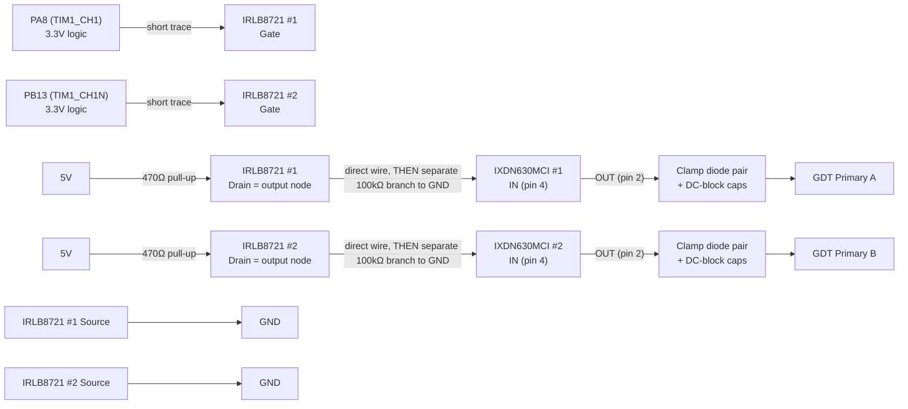
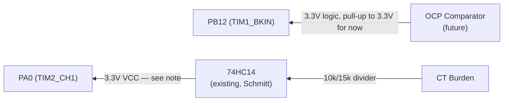
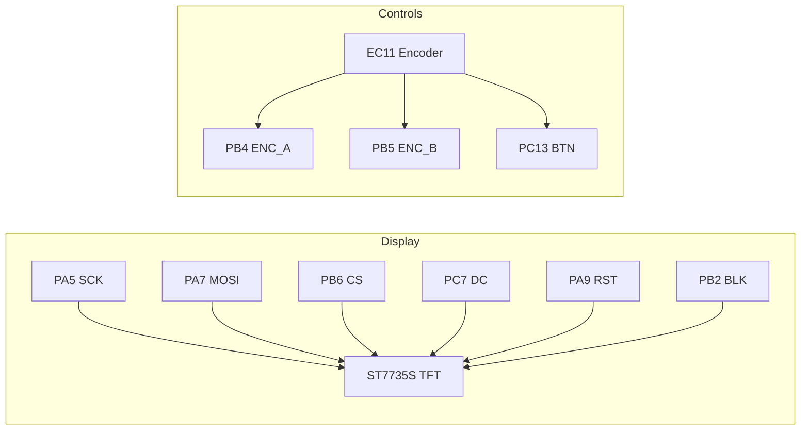
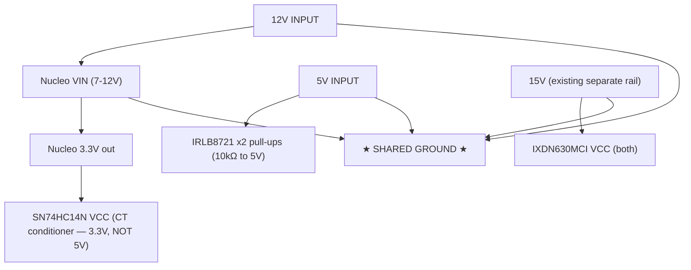
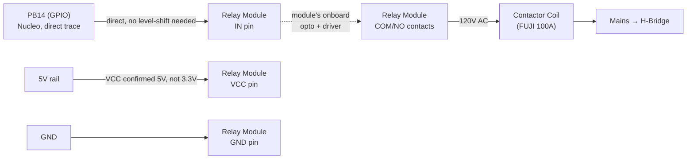
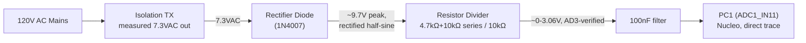

# Board v2 — Direct-to-Morpho Design (supersedes JST harness)

Simplified single-perfboard design. Nucleo sits directly on morpho headers,
all signal traces short. No isolators, no stacked perf, no JST harness.
See `docs/SHIELD_LAYOUT.md` and `docs/JST_CONNECTORS.md` for the deprecated
v1 design and lessons learned (ADuM1201 pinout mismatch, BKIN latch behavior
— still useful background even though the topology changed).

## Why the change

v1 (stacked perf + JST + Si8621 isolators) had long flying leads and
hand-soldered SOIC-8 breakouts — too many failure points, confirmed the hard
way debugging a dead isolator channel. v2 removes both: single board, short
direct traces, isolators dropped (their isolation rationale was already gone
once we went single-star-ground; see below for what replaces their level-shift
function).

---

## PWM Output Path (Nucleo → IRLB8721 level-shift → IXDN630MCI → GDT)

**FINAL: using IRLB8721 MOSFET level-shifters, not the 74HCT14.** No HCT part
in stock, and the IRLB8721 is a logic-level MOSFET (Vgs-th ~1-2V, drives
cleanly from 3.3V) already in the parts drawer. TO-220 package is also much
easier to hand-solder reliably than another DIP-14 — see the whole isolator
saga this design replaces.


```mermaid
graph LR
    PA8["PA8 (TIM1_CH1)<br/>3.3V logic"] -->|"short trace"| Q1G["IRLB8721 #1<br/>Gate"]
    PB13["PB13 (TIM1_CH1N)<br/>3.3V logic"] -->|"short trace"| Q2G["IRLB8721 #2<br/>Gate"]

    V5A["5V"] -->|"470Ω pull-up"| Q1D["IRLB8721 #1<br/>Drain = output node"]
    V5B["5V"] -->|"470Ω pull-up"| Q2D["IRLB8721 #2<br/>Drain = output node"]

    Q1D -->|"direct wire, THEN separate 100kΩ branch to GND"| IXDN1["IXDN630MCI #1<br/>IN (pin 4)"]
    Q2D -->|"direct wire, THEN separate 100kΩ branch to GND"| IXDN2["IXDN630MCI #2<br/>IN (pin 4)"]

    Q1S["IRLB8721 #1 Source"] --> GND1["GND"]
    Q2S["IRLB8721 #2 Source"] --> GND2["GND"]

    IXDN1 -->|"OUT (pin 2)"| PROT1["Clamp diode pair<br/>+ DC-block caps"]
    IXDN2 -->|"OUT (pin 2)"| PROT2["Clamp diode pair<br/>+ DC-block caps"]
    PROT1 --> GDT1["GDT Primary A"]
    PROT2 --> GDT2["GDT Primary B"]
```

> **RESISTOR VALUES UPDATED (AD3-verified) — pull-up 10kΩ → 470Ω, pulldown
> 10kΩ → 100kΩ.** Bench test with only the 10kΩ pull-up in place showed a
> slow RC-dominated rising edge (3.26µs measured rise time, 63ns fall —
> asymmetric because the MOSFET actively pulls the falling edge but the rising
> edge is passive RC charging through the pull-up). Backing out the time
> constant: RC≈1.48µs at R=10k implies ~148pF of parasitic capacitance on the
> node — higher than expected, most likely the IRLB8721's own Coss (larger
> TO-220 power MOSFETs have more output capacitance than small-signal parts;
> traded off against easy hand-soldering and logic-level gate threshold).
> Lowering the pull-up to 470Ω cuts the rise time to ~155ns (2.2×R×C),
> fitting inside the 300ns dead-time budget. Current draw at 470Ω when the
> MOSFET is ON: 5V/470Ω≈10.6mA per channel — trivial for the 5V/5A supply.
>
> **⚠️ CRITICAL — do not use equal pull-up/pulldown values.** If the pulldown
> at the IXDN630MCI input were also 10kΩ, it would form a resistive DIVIDER with
> the pull-up (not clean logic levels): 5V×10k/(10k+10k)=2.5V when the MOSFET
> is off — well below the IXDN630MCI's VIH=3.5V, guaranteed to fail. The
> pulldown must be much WEAKER (higher resistance) than the pull-up so it
> barely loads the node in normal operation: at 470Ω pull-up + 100kΩ
> pulldown, the node still reaches ~4.98V (negligible ~1% drop), while still
> providing a defined LOW (gate driver off, safe) if the pull-up/MOSFET path
> is ever disconnected.
>
> **Ringing observed:** 36-38% overshoot and excursions to ~-0.55V on both
> channels during this test — likely LC ringing from the fast (63ns) MOSFET
> turn-off interacting with stray wiring inductance on the current flying
> leads. Watch this once the IXDN630MCI is wired in (its input loading should
> add damping) and once final board wiring is tightened (shorter leads, less
> loop inductance). If it persists, a small Schottky (e.g. 1N5819) clamped
> from the drain node to GND would tame it — same principle as the GDT
> protection network, just scaled down for this node.

**CT / burden circuit — CONFIRMED, reused from the proven ESP32 build:** work
coil leg → 2kV cap → 40T ferrite toroid CT → 100Ω 100W burden resistor. This
exact combination was battle-tested on the ESP32 version (successfully fed
into its ADC for display) — keep it as-is.

**74HC14 input divider (10kΩ/15kΩ) — NOT YET VERIFIED for this signal path.**
That divider value was carried over from the ESP32's `PIN_VCO_IN` comment,
which scaled a clean CD4046 VCO square wave for a frequency counter — a
different signal than the CT burden's analog sine feeding a Schmitt trigger.
**Do not treat 10k/15k as final.** Once the burden circuit is wired and the
coil is running (even at low bench power), scope the actual burden voltage
on the AD3 and size the divider from that real measurement — same approach
used to calibrate the TIM1 clock constant earlier. The 74HC14 Schmitt
thresholds at 3.3V VCC are VIH≈2.3V / VIL≈1.0V — the divided signal needs to
clear both with margin, without exceeding ~3.8V absolute max on peaks.

**Per-channel circuit (×2, one per PWM signal):**

| MOSFET pin | Connects to |
|-----------|-------------|
| Gate | Nucleo PA8 or PB13 (3.3V logic), directly, short trace |
| Source | Ground |
| Drain | **470Ω** pull-up to 5V **=** the level-shifted output node → direct wire to IXDN630MCI IN, plus a separate **100kΩ** branch to GND |

> **⚠️ THIS CIRCUIT INVERTS THE SIGNAL.** MOSFET off (gate low) → drain pulled
> to 5V (HIGH). MOSFET on (gate high) → drain pulled to GND (LOW). So Nucleo
> LOW → IXDN630MCI sees HIGH, and Nucleo HIGH → IXDN630MCI sees LOW.
>
> **Firmware compensates by flipping TIM1 CCER polarity bits** (`CC1P`/`CC1NP`)
> in `PwmDrive::init()` so the Nucleo pins output pre-inverted logic, which
> this circuit un-inverts back to correct polarity at the IXDN630MCI. Complementary
> relationship between the two channels is preserved either way (invert both).
> **Already applied and verified in firmware.**
>
> **100kΩ pulldown** stays on each IXDN630MCI input (fail-safe if a MOSFET drain
> node is ever disconnected — pulls IXDN630MCI input low = gate off, safe
> default). Must be a SEPARATE branch to GND, NOT in series between the
> drain and the IXDN630MCI input (that miswiring caused a slow RC sawtooth
> during bench test — see resistor-value note above for the full story).

**Speed note — ROUND 2 (AD3-verified, 470Ω, UNLOADED — IXDN630MCI not yet
wired in, 100kΩ pulldown present, probed at Drain):** rise time improved
from 3.26µs to **325ns**, but that STILL EXCEEDS the 300ns dead-time budget
— the rising channel isn't fully settled before the dead-time gap closes,
which defeats the purpose of the gap. Also observed 16-20% overshoot with
excursions to **-0.39V to -0.43V** on both channels — LC ringing, likely from
parasitic inductance in the current flying-lead wiring interacting with the
MOSFET's switching edge and drain capacitance.

> **Important caveat: this is an UNLOADED measurement.** The IXDN630MCI was not
> connected. Its input capacitance (typically small, low-pF range) may add
> some damping once wired in, which could reduce the observed overshoot —
> this measurement is likely a worst case, not the final number. Don't
> over-correct (e.g. going straight to very low pull-up values or heavy
> snubbing) based on unloaded data alone. Re-test with the real IXDN630MCI load
> before adding damping components.

**Next iteration — sequenced (don't jump straight to snubbing):**
1. **Lower pull-up further: try 220Ω** (still unloaded is fine for this
   step). Current draw at 220Ω: 5V/220Ω≈23mA/channel, still trivial. Should
   push rise time further below 300ns.
2. **THEN wire in the real IXDN630MCI** and re-probe at the same point (or its
   IN pin directly) BEFORE adding any damping. Its input capacitance may
   already reduce the ringing seen in the unloaded test — no point adding
   snubbing/clamp components to fix a worst-case number that partially
   self-resolves with the real load present.
3. **Only if ringing is still a problem with the real load:** add a small
   series resistor (10-33Ω) between the MOSFET drain and the
   pull-up/pulldown/IXDN630MCI node (snubs the ring, small RC cost), or a small
   Schottky (1N5819) clamped from the node to GND (and optionally another to
   5V) — same principle as the proven GDT protection network, scaled down.
4. **Temporary mitigation while tuning:** bump dead-time to 500ns via serial
   (`d500`) for extra margin during resistor-value experimentation; dial
   back down once edges are comfortably fast.

Fall time has stayed consistent (~63-70ns, MOSFET actively driven) across
both resistor values and is not the concern — it's the passive rising edge
and its ringing that need more work.

## GDT Primary Protection Network (carried over from ESP32 build, PROVEN)

**Ran for over a year with zero IXDN losses after implementing this — keep
it, symmetric on BOTH channels this time** (original build had it fuller on
one channel than the other since it mixed IXDI + IXDN; v2 uses IXDN630MCI on
both, so both get the full network).

The GDT's leakage inductance causes voltage ringing/overshoot on the driver
output pin at each switch transition. Without clamping, this ringing can
exceed the IXDN630MCI's output stage ratings and destroy it — which is exactly
what happened before this network was added. This is a documented, hard-won
fix, not a guess.

```
                      15V
                       │
                     Anode
                    (D_upper)
                     Cathode
                       │
IXDN630MCI OUT ───────────●─────────┬──────────► GDT Primary
 (pin 2)                │         │
                       Anode    1µF ‖ 1µF
                      (D_lower)  (parallel,
                       Cathode    DC-block)
                       │
                      GND
```

**Per-channel components (×2, one set per IXDN630MCI):**

| Component | Connects to |
|-----------|-------------|
| D_lower (1N5819) | Anode → GND, Cathode → IXDN630MCI OUT node |
| D_upper (1N5819) | Anode → IXDN630MCI OUT node, Cathode → 15V |
| 2x 1µF ceramic (parallel) | Between IXDN630MCI OUT node and GDT primary lead |

**What each part does:**
- **Clamp diode pair** — if the OUT node rings below GND, D_lower conducts
  and clamps it near 0V. If it rings above 15V, D_upper conducts and clamps
  it near 15V. Protects the IXDN630MCI output stage from destructive overshoot.
- **1µF ‖ 1µF DC-blocking caps** — prevents any DC bias / duty-cycle asymmetry
  from driving a net DC current through the GDT primary (which would walk the
  core toward saturation over time). Two in parallel for lower ESR and higher
  ripple current handling than a single cap. Also has a secondary filtering
  effect on the edge shape seen at the transformer — this was likely what
  gave the "cleaner square wave" result observed during original testing.

**Verification plan:** wire this on both channels as designed. If the AD3
shows signal degradation at the GDT secondary once built, the fix is simple —
bypass the network on one channel at a time (jumper straight from IXDN630MCI OUT
to the GDT primary lead) and compare. Easy to isolate since each channel has
its own components.

### Other parts considered, not used

- SN74HCT14N — correct electrical fit (VIH=2.0V fixed) but not in stock
- SN74HC14N (the one in stock) — VIH scales with VCC, marginal at 3.3V input,
  same issue as feeding IXDN630MCI directly. Not used for this path.
- IRF840 / IRF3710 / generic IRF**N — standard threshold (~4V), won't fully
  turn on from 3.3V gate drive. Not suitable.
- SCT2450KE — SiC power MOSFET, wrong threshold and wildly overkill. Not suitable.
- TL494CN — PWM controller IC, not a level-shifter. Wrong tool for this job.

## GDT Secondary → IGBT Gate Network (carried over from original Induction
Heater build, PROVEN)

**IGBT bricks: 2x SKM200GN12T4** (dual half-bridge modules, 1200V/200A each —
two modules form the full bridge). Gate network is unchanged from the
original design, which runs well on it — from `docs/IGBT-Gates.txt`
(original ESP32 build docs, carried forward unchanged since day 1):

> The gates of the IGBT modules are connected to the GDT secondaries via
> parallel 5W resistors and 5W 1N5821 Schottky reverse diodes, to provide
> enough delay to prevent the gates from being turned on too early and
> prevent shoot-through on one side of the full bridge. Gate resistors
> rated at 3.3Ω gave the best-looking square wave gate signal on the SKM
> bricks (may need adjustment if it ends up smoothing the switching signal
> too much).

So: **3.3Ω 5W series gate resistor + 1N5821 5W Schottky diode (in parallel,
reverse-biased) on each gate**, same as the original design. No
re-engineering — this combination already has proven runtime hours on the
original build and has never changed.

**GDT secondary bring-up note (AD3, no IGBT connected yet):** probing an
open-circuit secondary pair showed a large free-ringing waveform (measured
~±28V, 81% overshoot, ~112kHz) — this is the LC tank of the winding's
leakage inductance against its own capacitance with nothing to damp it, NOT
a fault. A GDT secondary is designed to drive into a gate resistor + IGBT
gate capacitance; with no load, there's nothing to clamp the ring. Confirmed
signal is present with no damage ("got signal, no magic smoke"). For a more
representative bench reading before the IGBTs are wired in, load the pair
under test with a resistor near the real gate resistor value (3.3Ω) — this
should collapse most of the open-circuit ringing.

### Bring-up verification (AD3, IGBT gates loaded, no HV, PLL feedback closed)

With the GDT secondaries wired through the real 3.3Ω/1N5821 gate network
into the SKM200GN12T4 gates (Phase 4, low-voltage bench supply, no power
stage HV), and after fixing an unrelated PA1/PA0 wiring swap (see Feedback
path section below), both gate signals scoped clean and matched:

| Measurement | CH1 | CH2 |
|---|---|---|
| Frequency | 80.079 kHz | 80.074 kHz |
| Amplitude | 14.401 V | 14.224 V |
| Maximum | 17.212 V | 18.045 V |
| Minimum | -18.827 V | -17.061 V |
| Peak2Peak | 36.039 V | 35.107 V |
| Overshoot | 25.1% | 23.4% |
| Rise/Fall time | 0.857µs / 0.623µs | 0.697µs / 0.784µs |

Matching frequency on both channels confirms the PLL feedback loop closed
correctly. Complementary-looking amplitude/rise-fall relationship between
channels is consistent with correct full-bridge gate drive phasing.

**⚠️ Gate voltage margin note:** SEMIKRON 1200V Trench IGBT4 modules in this
family (SKM200GB12V and related SKiiP parts) spec **VGES (gate-emitter
absolute max) at ±20V**. Not independently confirmed against the exact
SKM200GN12T4 datasheet PDF (only cross-referenced from closely related
parts in the same family/die) — worth a direct datasheet check if a hard
copy is on hand. Measured excursions here (+17.2/+18.0V, -18.8/-17.1V)
stay under that limit but with as little as ~1.2V margin on the negative
side (CH1: -18.827V). This is the same GDT-secondary/3.3Ω/1N5821 topology
that ran a full year with zero gate/driver losses on the original ESP32
build, so this margin was likely already present and implicitly tolerated
— not a new problem, but worth revisiting (e.g. GDT clamp/snubber tuning)
if gate-related issues ever show up, especially once real bus voltage and
higher di/dt are introduced.

### BOM (this section)

| Qty | Part | Value/Type | Notes |
|-----|------|-----------|-------|
| 2 | IGBT module | SKM200GN12T4 | Dual half-bridge, 1200V/200A, forms full bridge together. Carried over from original design, unchanged since day 1. |
| 4 | Resistor | 3.3Ω, 5W | Series gate resistor, one per IGBT gate (4 gates total across 2 modules). Unchanged from proven original build. |
| 4 | Diode | 1N5821 Schottky, 5W | Reverse-biased, parallel with each gate resistor — delays turn-on to prevent shoot-through. Unchanged from original build. |

## Feedback / Fault Path (Power stage → Nucleo)


```mermaid
graph RL
    OCP["OCP Comparator<br/>(future)"] -->|"3.3V logic, pull-up to 3.3V for now"| PB12["PB12 (TIM1_BKIN)"]
    CT["CT Burden"] -->|"10k/15k divider"| HC14["74HC14<br/>(existing, Schmitt)"]
    HC14 -->|"3.3V VCC — see note"| PA0["PA0 (TIM2_CH1)"]
```

> **Run the existing 74HC14 (CT frequency conditioner) from 3.3V, not 5V.**
> Its output feeds directly into PA0 — a 5V swing would exceed the Nucleo's
> GPIO absolute max (~VDD+0.3V ≈ 3.6V). At 3.3V VCC, HC14 thresholds become
> VIH≈2.3V / VIL≈1.0V — recheck the CT divider still crosses these cleanly.
> **BKIN (PB12):** until the OCP comparator is built, add a pull-up to
> **3.3V** (not 5V) so it idles safely HIGH (break inactive). Use a bare
> resistor only (10kΩ) — no filter cap, or at most ~1nF if noise filtering
> is ever needed. BKIN is a hardware break designed for ~6ns response; a
> 100nF cap (10kΩ+100nF ≈ 1µs) would meaningfully defeat that speed once a
> real OCP comparator is wired in. When the comparator is added, its output
> must also be 3.3V-logic (or clamped/divided) before reaching PB12 — never
> feed it 5V directly.
>
> **✅ RESOLVED — PA1/PA0 wiring swap (found during Phase 4 bring-up).**
> The 74HC14 output (pin 1Y) was physically wired to **PA1** instead of
> **PA0**, leaving PA0 (the real PLL feedback input, `TIM2_CH1`) floating.
> Symptom: immediate `OCP_SW` fault on every start attempt — `Protection::
> checkFast()` polls PA1 as the tank current sense input (`PIN_ADC_OCP`),
> and a fast-toggling square wave landing there gets ADC-sampled essentially
> at random within its cycle. Confirmed on the fault screen: ADC reading
> 3556 (well above the OCP_THRESHOLD of 3000) despite no real overcurrent —
> consistent with sampling a digital squarewave mid-high, not sensor noise
> on a floating pin (the initial theory, since ruled out). Fixed by moving
> the HC14 1Y lead to PA0; PA1 left disconnected until the real current
> sense circuit is built. Firmware also gained a display-side fix (fault
> screen now shows "OVERCURRENT (HW)" vs "OVERCURRENT (SW)" so the two
> `checkFast()` fault sources can be told apart without a serial monitor —
> useful since this board only has serial access in USB/dev-jumper mode,
> not in full-power test mode). Post-fix: PLL feedback confirmed live,
> 80.08kHz measured on both gate channels, see bring-up verification below.

## User Interface (unchanged from v1)


```mermaid
graph LR
    subgraph Display
        PA5["PA5 SCK"] --> TFT["ST7735S TFT"]
        PA7["PA7 MOSI"] --> TFT
        PB6["PB6 CS"] --> TFT
        PC7["PC7 DC"] --> TFT
        PA9["PA9 RST"] --> TFT
        PB2["PB2 BLK"] --> TFT
    end
    subgraph Controls
        ENC["EC11 Encoder"] --> PB4["PB4 ENC_A"]
        ENC --> PB5["PB5 ENC_B"]
        ENC --> PC13["PC13 BTN"]
    end
```

## Power Distribution (shared ground, no isolation)


```mermaid
graph TD
    IN12["12V INPUT"] --> NUC["Nucleo VIN (7-12V)"]
    IN5["5V INPUT"] --> Q["IRLB8721 x2 pull-ups (10kΩ to 5V)"]
    NUC --> V33["Nucleo 3.3V out"]
    V33 --> HC["SN74HC14N VCC (CT conditioner — 3.3V, NOT 5V)"]
    IN15["15V (existing separate rail)"] --> IXDN["IXDN630MCI VCC (both)"]

    IN12 --> STAR["★ SHARED GROUND ★"]
    IN5 --> STAR
    IN15 --> STAR
    NUC --> STAR
```

> **12V → Nucleo VIN.** **5V → IRLB8721 pull-up resistors** (this is the only
> thing 5V powers now — the level-shift is passive, not chip-based).
> **Nucleo 3.3V → SN74HC14N VCC** (CT conditioner, must stay off 5V to protect
> PA0). **15V (separate, existing) → IXDN630MCI VCC.** All sharing one ground.

**Rail summary:**

| Rail | Source | Powers |
|------|--------|--------|
| 12V | Board input | Nucleo VIN |
| 5V | Board input | IRLB8721 x2 pull-up resistors (level-shift reference) |
| 3.3V | Nucleo onboard regulator | SN74HC14N VCC (CT conditioner), pull-ups |
| 15V | Existing separate rail | IXDN630MCI VCC (gate drive) |

---

## BOM Changes from v1

**Removed:**
- 2x Si8621BB-B-IS + ADuM1201 breakouts
- 2x 8-pin JST connectors + associated wiring
- TVS diodes / Schottky clamps that were part of the isolator input protection

**Added:**
- 2x **IRLB8721** (logic-level N-MOSFET, TO-220) — PWM level-shift, one per
  channel. **In parts drawer, confirmed, no order needed.**
- 2x **470Ω** pull-up resistors (MOSFET drain → 5V, forms the level-shift
  output). *AD3-verified value — was 10kΩ, too slow, see notes above.*
- 2x **100kΩ** pulldown resistors (level-shift output → GND, fail-safe branch,
  NOT in series with the IXDN630MCI input). *Was 10kΩ — would have formed a
  voltage divider with the pull-up and failed to reach IXDN630MCI's VIH.*
- 1x pull-up resistor (10kΩ to 3.3V) on BKIN, temporary until OCP comparator exists

**Unchanged:**
- Existing **SN74HC14N** (TI, genuine, CT frequency conditioner) — reroute its
  VCC from 5V to 3.3V (see feedback path note above)
- IXDN630MCI x2, GDT, gate resistors/diodes, TFT, encoder, LEDs, NTC
- GDT primary protection network (clamp diodes + DC-block caps) — carried
  over from the proven ESP32 build, now applied symmetrically to BOTH
  channels (see dedicated section above). Need: 4x 1N5819, 4x 1µF ceramic
  (2 per channel).

**No longer needed (was going to order, now unnecessary):**
- SN74HCT14N — replaced by the IRLB8721 level-shift circuit

## Physical Layout Notes

- Nucleo morpho headers (CN7/CN10) soldered directly to the new perfboard —
  no cables between Nucleo and driver components
- Keep PA8/PB13 → IRLB8721 gate traces as short as physically possible (this
  was the exact class of problem that caused the v1 debug session)
- IRLB8721s and IXDN630MCIs clustered close together, short traces between them
- TO-220 packages are easy to hand-solder reliably — much less risk than the
  SOIC-8 isolators that caused the v1 rework
- TFT + encoder can stay on longer leads (low-speed, non-critical signals)
- Single ground — no star-point complexity needed for a one-board design,
  just a solid ground plane/bus

## ✅ RESOLVED — boot hang with no coil running (PA0/HC14 self-oscillation)

**Symptom:** after wiring up new 240V/60A lab power and the OCP-board rework,
the board appeared "dead" — TFT stayed dark (later: white/blank), solid
red LED. Initially suspected RF damage from a nearby VTTC test, or a
disturbed TFT SPI wire from all the physical rework this session.

**Diagnosis process:**
1. Built a minimal `tft_hello` PlatformIO env (`-DTFT_HELLO_MODE`) touching
   ONLY the TFT + backlight, nothing else — confirmed the display and its
   6 SPI/control leads are fully healthy (green "Hello World!" rendered
   correctly). Ruled out RF damage and TFT wiring as the cause.
2. Added step-by-step `Serial.println()` tracing around each module's
   `::init()` call in `main.cpp` — isolated the hang to `PllControl::init()`
   specifically (not `Display::init()` as first suspected).
3. Added finer-grained tracing inside `PllControl::init()` itself — isolated
   the hang to immediately after `s_timer->resume()`, i.e. the moment TIM2
   input capture on PA0 is actually armed.
4. Confirmed by physically disconnecting the 74HC14 output from PA0 and
   power-cycling — booted cleanly straight to the display idle screen.

**Root cause:** with no coil running, the tank CT/burden feeding the
74HC14 (frequency-feedback conditioner) has no real AC signal — its input
sits near the Schmitt-trigger threshold with nothing to cleanly cross it,
and the 74HC14 self-oscillates at a high, uncontrolled frequency. The
instant `PllControl::init()` armed TIM2 capture on PA0, this flood of
edges kept the capture ISR firing continuously, starving the rest of
`setup()` (particularly `Display::init()`, which never got reached) —
this looked exactly like a hang/dead board, but was neither RF damage nor
a wiring fault.

**Fix (in `PllControl.cpp`/`.h` and `StateManager.cpp`):**
- `PllControl::init()` now configures TIM2 capture but leaves it **paused**
  (no `resume()` call at init time) — boot-safe, matching the existing
  pattern where the contactor and PWM outputs also default off at boot.
- Added `PllControl::startCapture()` / `stopCapture()`. `StateManager::
  startup()` now calls `startCapture()` right before enabling PWM (only
  when frequency feedback is actually needed); `shutdown()` calls
  `stopCapture()` to keep PA0 quiet again once stopped.
- Result: the board now boots cleanly to the idle/display screen
  regardless of whether the HC14/CT signal is present, and only arms
  frequency capture during an actual run attempt.

**New test env added for future display-layer bring-up:** `tft_hello`
(`pio run -e tft_hello -t upload`) — bare-minimum TFT sanity check with
step-by-step serial tracing (backlight → initR → fillScreen → text),
useful any time display behavior is in question without wading through
the rest of the project's modules.

## Full H-Bridge and Tank Component Record

Never previously documented in this file — captured here for the record.

**H-Bridge:**
- **2x IGBT modules** — **SKM200GN12T4 (1200V/200A continuous)**, sourced
  from `docs/IGBT-Gates.txt`, confirmed matching (initial "300A" mention
  was a verbal slip, corrected).
- **Bus bars:** solid copper, 1/4" (DC bus interconnect)
- **Snubbers:** 2x AVX MKP, 2.5µF, 1000V
- **DC bus caps:** 4x RIFA, 2200µF, 500V DC, wired series-parallel

**Tank circuit:**
- **Tank cap:** 2.6µF, 950A, 700Vrms, 400kVAR, water-cooled style
- **Output cap (IGBT output side):** 3.5µF, 120A, 1200V AC
- **Work coil transformer/core:** 5x Ferrite Toroid Core 5000-1,
  2.40" x 1.40" x 0.50" each
- **Winding:** 12 turns Litz wire, ~3mm total wire thickness (strand
  count not recorded — heavy-duty, multi-strand Litz)

## ✅ MILESTONE — first real induction heating, full chain proven (manual drive mode)

**Result:** end-to-end system proven working with real HV and real coil
current for the first time on Board v2. Nucleo → PWM (TIM1, dead-time) →
IRLB8721 level-shift → IXDN630MCI → GDT → SKM200GN12T4 gates → work coil
→ real eddy-current heating in a copper test piece in the crucible.

**How this was reached:** the OCP board's analog bench tests (signal
generator injection, wire-loop-through-toroid injection) both produced
zero response despite part replacement — see the troubleshooting history
above. Rather than keep chasing a dead-quiet bench simulation, switched to
getting a real running signal from the actual system instead (same
philosophy as the original pre-DeCosta ESP32 build: fully manual tuning
by instrument, no automated feedback). Added `MANUAL_DRIVE_MODE` (see
`platformio.ini` / `main.cpp`) — a dedicated firmware build where the
encoder directly sets PWM frequency (20kHz-100kHz range, 500Hz/step), no
PLL feedback capture is ever armed (PA0 stays completely quiet — no risk
of the HC14 self-oscillation issue recurring), and no OCP hardware is
wired in. **The only automated protection active in this mode is the NTC
over-temp check.** Contactor sequencing (mains check, bus charge) reuses
the same safety-checked `MainsControl` path as normal firmware.

**Config changes to support this (shared `config.h`, affects all
firmware envs):** `PWM_FREQ_MIN_HZ` lowered from 50000 to **20000** (this
coil's resonance is well below the old floor), `PWM_FREQ_START_HZ`
lowered from 80000 to **60000** to better match this coil.

**First test (go/no-go, LOW power):** ~30V AC variac input. Added a
temporary visual resonance aid — green LED + 1N4007 + series resistor
(started ~6.8-10kΩ, 5W, sized conservatively from this expected voltage
range) across the direct Tank V+/V- coil tap (NOT the CT/burden — kept
electrically separate from both sense paths feeding the OCP/PLL boards).
**Result: LED lit brightly at 57kHz** — first real resonance indication
on this coil, matches this build's expected range.

**Second test (higher power):** DC bus brought up to **50V / 5A**.
**Copper test piece in the crucible reached ~200°F very quickly** —
confirmed real, working eddy-current heating. LED (visual aid only, not
part of the protective circuit) failed open (no smoke, no melting) at
this higher power/current level — expected, it was sized for the lower
first-test voltage range; inconsequential since it was never a functional
component. Consider a higher-value series resistor (e.g. 15kΩ+) if a
visual aid is wanted again at this power level.

**What this proves:** PWM generation, dead-time, gate drive, GDT, IGBT
bridge, contactor sequencing, and manual frequency control are all
confirmed working with real HV and real coil current. The OCP hardware
path (see below) remains the one open item before this can run
unsupervised or at higher power/duration — manual variac ramp + operator
judgement + NTC over-temp are still the only protection layers in
`MANUAL_DRIVE_MODE`.

**Next planned step:** with the OCP board now physically wired in
(CT/burden → "FB-TX in", coil taps → "Tank-in +/-"), but its output
**intentionally left disconnected from PB12** for this round, run again
and take real measurements directly off the OCP board (pin 6, and
whatever's observable at the front-end/Q1 stage) with genuine current and
voltage present — something the earlier dead-quiet bench tests couldn't
provide. This should finally reveal whether the OCP board's front end
responds to a real signal, independent of any risk to the Nucleo since
it's not wired to PB12 yet.

## ⚠️ OPEN — OCP circuit, blocking HV bring-up (paused, resume here)

**Decision made:** rather than building a new OCP comparator from
scratch, replicate the proven analog peak-detect + latch circuit from the
original DeCosta board (ran reliably for over a year on the same CT/
burden/winding hardware this build reuses). This was never meant to be a
new design effort — it's a straight port. Reconstructed from the DeCosta
board's schematic image (not yet independently traced/confirmed on the
physical board):

- **CT/burden/coupling:** 20T current transformer → 100Ω burden → 200Ω
  series R → 330nF coupling cap (blocks DC offset) → 1N5819 back-to-back
  clamp diodes (D2/D3) → 1N4739A (9.1V) series zener pair (D4/D5, likely
  coarse threshold/protection ceiling).
- **Comparator/threshold stage:** MPSA06 (Q1) + R12 (51k) + R16 (15k) +
  R13/R1 (10k) + a 10-turn 20kΩ "Current Limit" pot — pot most likely sets
  the fine trip threshold via Q1's bias, though this split (zener ceiling
  vs. pot fine-tune) is inferred from layout, not confirmed by tracing.
- **Latch:** MM74HCT74N dual flip-flop, clocked/set when Q1 conducts.
  Latched output drives an "enable" net.
- **Driver disable:** "enable" net feeds UCC27425 (dual gate driver)
  directly — this is the hardware-speed kill, analogous to this build's
  TIM1_BKIN.
- (Unrelated to OCP, don't port: LM555 + 200kΩ pot near U8 is a
  soft-start/frequency-ramp circuit on the DeCosta board, not part of the
  protection path.)

**Recommended port approach for Board v2:** replicate this analog stage
(or reuse the physical DeCosta sub-circuit if separable) and feed its
digital "trip" output straight into **PB12/BKIN** — plays to BKIN's actual
hardware-speed strength instead of trying to re-derive an equivalent
threshold in software via the ADC on PA1.

**Trip-current calibration:** not yet known in real amps. The zener+
transistor threshold stage is hard to back-calculate accurately from
component values alone. If a past calibration note (pot position ↔
measured coil current via clip-on ammeter) exists, that's worth more than
recalculating from scratch — check for it before doing a fresh calibration
pass once the stage is rebuilt.

**Why this is paused, not solved:** the CT/burden/DeCosta OCP components
were physically disconnected and partially salvaged for the Board v2
build. Reassembling this is a real rebuild task (sourcing/re-placing
components, re-wiring, re-verifying), not a quick reconnect — bigger scope
than fits in the current bring-up session. **This is the hard blocker on
connecting HV and testing the full bridge + work coil** — do not apply HV
power until this OCP path (or an equivalent fast-trip protection) is back
in place and verified. Neither PA1 (floating, no real sensor) nor PB12
(bare 10kΩ pull-up placeholder) currently provide real overcurrent
protection.

**Context — everything else is on track:** PWM generation with dead-time
(microcontroller signal gen goal #1) is done. PLL frequency feedback
(goal #2) closed successfully today after fixing the PA1/PA0 wiring swap
— 80.08kHz confirmed on both gate channels with the real IGBT gate load.
OCP was never intended to be a new design effort; it's the one piece still
using proven "borrowed" analog circuitry rather than the new STM32 signal
path, and that borrowing is now blocked on a physical rebuild, not a
design question.

## Still TODO on this design

- **Firmware: flip TIM1 CCER polarity bits (`CC1P`/`CC1NP`) in `PwmDrive::init()`**
  to compensate for the IRLB8721 level-shift inversion. Do this BEFORE first
  power-up of this path.
- **Measure actual CT burden voltage on the AD3** with the coil running (low
  power bench test is fine) and size the 74HC14 input divider from that real
  number. The 10k/15k currently in the docs is a carryover from the old
  ESP32 VCO-frequency-counter divider, NOT calculated for this signal — same
  proven CT/burden hardware, different downstream circuit than before.
- Design/wire the OCP comparator (currently just a 3.3V pull-up placeholder
  on BKIN)
- **Re-verify on AD3 with corrected 470Ω pull-up / 100kΩ pulldown values**
  (first pass with 10kΩ/10kΩ showed a slow RC rise and a miswired series
  pulldown — both diagnosed and fixed in this doc, needs a fresh capture to
  confirm). Check rise/fall time and dead-time survives intact.
- Watch the ~37% overshoot / undershoot-to--0.55V ringing seen in the 10kΩ
  test — may improve once IXDN630MCI is wired in (adds damping) and wiring is
  tightened. Add a small Schottky clamp to GND on the drain node if it persists.

## Post-mortem: AD3 Channel 2 false ringing (RESOLVED — instrument, not circuit)

After the full IXDN630MCI array was wired (clamp diodes + DC-block caps on
both channels, per the protection network above), initial probing showed
severe, consistent asymmetry: Channel 1 read ~10-20% overshoot, Channel 2
read 75-165% overshoot, across THREE different load resistors (22Ω, ~10Ω,
~470Ω-parallel). The ratio held steady regardless of load, which was the key
clue pointing away from a real load-dependent resonance.

**Diagnostic sequence that found it:**
1. Verified board wiring, diode orientation, solder joints — all clean.
2. Tied both probe grounds directly at the IXDN pin instead of a shared
   distant Nucleo GND — reduced C1 slightly, C2 barely changed. Ruled out
   ground-lead inductance as the primary cause.
3. **Physically swapped the two probes between the channels** (same test,
   same load) — the bad reading STAYED on scope Channel 2, even though it
   was now connected to the physical node that had previously read clean.
   This conclusively proved the fault was in the instrument/probe, not the
   board (a real circuit fault would have followed the physical node, not
   the scope channel).
4. Swapped in a different physical probe on Channel 2 — overshoot dropped
   from 100%+ to 6.67%, matching Channel 1's clean behavior.
5. **Confirmed on a bench oscilloscope: perfect square wave, no ringing.**

**Root cause: the AD3's Channel 2 probe/cable (or its compensation) was
producing false ringing on fast edges (~28-30ns rise time).** The circuit —
IRLB8721 level-shift, IXDN630MCI drive, GDT protection network — was correct
the entire time. No hardware changes were needed.

**Lesson for future AD3 use on this project:** when chasing an asymmetric
or unexpected reading between channels, swap probes between channels EARLY
in the diagnostic sequence (before extensive board rework) to rule out
instrumentation. A real circuit fault follows the physical node when probes
are swapped; an instrument fault follows the scope channel. Cross-check
against a bench scope if available and results still don't make sense.

---

## ✅ RESOLVED — formerly "OPEN ISSUES — RESUME HERE"

All three threads from the AC-sense wiring session are now closed. Left
here for history; see current values in the divider/BOM sections below.

### Issue 1 — AC-sense divider resistor value (RESOLVED)

Resized three times total (27k→22k→8.2k→**4.7kΩ+10kΩ series (14.7kΩ) /
10kΩ**), see the divider note in the AC sensing section below for full
history and why each single-resistor hand-calc kept missing the real
in-circuit peak (divider loading changes the TX secondary's effective
output — not a fixed source). AD3-verified final result at the divider
midpoint: **Maximum 3.0626V, Peak2Peak 3.0581V, overshoot 0.39%, 60.0Hz**
— clean half-wave rectified signal, ~0.54V margin under the 3.6V abs max.

### Issue 2 — PC1 overvoltage exposure (RESOLVED)

PC1 was briefly connected to the AC-sense divider while it was still
producing a 5.5V peak (before the mismatch was caught), above the
STM32F446RE's standard I/O absolute max (~3.6V). Multimeter
continuity/leakage check on PC1 (Nucleo powered off, PC1-to-GND and
PC1-to-3.3V vs. a known-good pin baseline) **checks out clean** — no
damage found. PC1 reconnected to the corrected 4.7k+10k/10k divider;
`Sensing::readAcRaw()` / "MAINS" display field to be watched during next
bring-up to confirm it tracks zero-crossings sensibly, but the pin itself
is cleared.

### Issue 3 — NTC reading anomaly (RESOLVED)

Root cause was a wiring fault (NTC not wired properly), not a circuit or
firmware issue. Fixed; NTC now reads and responds as expected in free air
and under load.

---

## HV Side — Contactor Control & AC Sensing (v2, direct wiring)

Adapted from `docs/MAINS_CONTROL.md` (v1) for the Board v2 architecture:
no JST harness, no Si8621 isolators — direct wiring on one perf, single
shared ground throughout. This section is the authoritative wiring for
the mains control portion of Board v2.

### System path

```
AC Mains → EMI Filter → Contactor → Rectifier → DC Bus → H-Bridge
```

The EMI filter (YS36Q1AN-50A type, on order, ETA Sept 8) is a chassis-mount
part, not on this board — see `MAINS_CONTROL.md` for its placement and the
mandatory earth-bond requirement. Everything below IS on Board v2.

### Contactor control — using an all-in-one relay module

**CORRECTION: using a pre-built relay module board, not discrete opto + diode
+ relay.** These common modules (e.g. Songle SRD-05VDC based) already
integrate the optocoupler, flyback diode, driver transistor, status LED, and
sometimes an onboard regulator. Just 4 pins to interface with: **VCC, GND, IN,
and the relay contacts (COM/NO/NC).** Much simpler wiring than the discrete
version — the module does all of it internally.


```mermaid
graph LR
    PB14["PB14 (GPIO)<br/>Nucleo, direct trace"] -->|"direct, no level-shift needed"| IN["Relay Module<br/>IN pin"]
    V5["5V rail"] -->|"VCC confirmed 5V, not 3.3V"| VCC["Relay Module<br/>VCC pin"]
    GND["GND"] --> GNDM["Relay Module<br/>GND pin"]
    IN -.->|"module's onboard<br/>opto + driver"| RELAY_OUT["Relay Module<br/>COM/NO contacts"]
    RELAY_OUT -->|"120V AC"| COIL["Contactor Coil<br/>(FUJI 100A)"]
    COIL --> MAINS["Mains → H-Bridge"]
```

| Relay module pin | Connects to |
|-------------------|-------------|
| VCC | 5V rail |
| GND | GND (shared board ground) |
| IN | PB14 (Nucleo), direct trace |
| COM | 120V AC hot (mains side) |
| NO (normally open) | Contactor coil (+) — closes when PB14 drives the module active |

> **IDENTIFIED: Teyleten Robot "1 Channel Optocoupler 3V/3.3V Relay HIGH
> LEVEL Driver Module"** (Amazon B07XGZSYJV). Confirmed **active-HIGH**
> from the product name/spec ("High Level Driver" — distinguishes it from
> the low-level/active-LOW sibling variant sold under the same style).
> **Matches the current firmware exactly** — `MainsControl::energize()`
> drives PB14 HIGH to energize, `deEnergize()` drives LOW. No firmware
> changes needed.
>
> **VCC RESOLVED: use 5V, not 3.3V.** User reviews on this module confirm
> the IN pin works directly from 3.3V logic (ESP32/STM32) with no extra
> circuitry, but the module runs more reliably ("happier") on 5V VCC for the
> relay coil driver side. Since the board already has a 5V rail for other
> purposes, power VCC from that — costs nothing extra and gives the relay a
> fuller, more reliable pull-in than running the coil driver at 3.3V.
>
> **Final pin-out: VCC → 5V rail, GND → shared ground, IN → PB14 direct
> (3.3V, no level-shift needed), COM/NO → 120V AC to contactor coil.**
>
> No JST or isolator needed here — PB14 wires directly to the module's IN pin
> on the same board. The module's onboard optocoupler still provides the
> logic-to-relay-coil isolation boundary, which is the important one (not
> board-to-board isolation, which v2 dropped in favor of single-ground
> simplicity).

### AC sensing (zero-cross / mains presence)


```mermaid
graph LR
    AC["120V AC Mains"] --> TX["Isolation TX<br/>measured 7.3VAC out"]
    TX -->|"7.3VAC"| DIODE["Rectifier Diode<br/>(1N4007)"]
    DIODE -->|"~9.7V peak,<br/>rectified half-sine"| DIV["Resistor Divider<br/>4.7kΩ+10kΩ series / 10kΩ"]
    DIV -->|"~0-3.06V, AD3-verified"| FILT["100nF filter"]
    FILT --> PC1["PC1 (ADC1_IN11)<br/>Nucleo, direct trace"]
```

| Component | Wiring |
|-----------|--------|
| Isolation TX secondary | → 1N4007 anode (measured 7.3VAC unloaded, not the 12V nameplate) |
| 1N4007 cathode | → divider node (top leg) |
| Divider: 4.7kΩ + 10kΩ (series, 14.7kΩ total) | Top leg, from rectifier cathode to divider midpoint |
| Divider: 10kΩ | Bottom leg, from divider midpoint to GND |
| Divider midpoint | → 100nF to GND (filter), → PC1 direct trace |

> **No smoothing cap on the rectifier output** — the ADC needs to see the
> rectified half-sine wave (dips near 0V twice per AC cycle) to detect
> zero-crossings. Only the small 100nF filter cap is present, sized to knock
> down HF noise without flattening the 120Hz envelope.
>
> **DIVIDER — RESOLVED after three iterations, final value 4.7kΩ+10kΩ
> series (14.7kΩ) / 10kΩ.** Full history, because the pattern here is worth
> remembering for future divider work:
>
> - **27kΩ** (from `MAINS_CONTROL.md`, v1 carryover) → too high a ratio,
>   5.4V peak p-p at midpoint, exceeded target.
> - **22kΩ** (recalculated from 7.3VAC TX open-circuit reading) → AD3-measured
>   **Maximum 5.5V, Peak2Peak 5.41V** at the midpoint, confirmed independently
>   via multimeter DC average (2.392V). Hand-calc from open-circuit TX voltage
>   did not match the loaded in-circuit peak.
> - **8.2kΩ** (resized from the 5.5V AD3-measured peak, target `3.0/5.5≈0.545`
>   ratio) → **not tried as a single resistor**; moved straight to available
>   E-series values instead (no 8.2kΩ on hand).
> - **7.5kΩ** (closest available single value to 8.2kΩ) → AD3-measured
>   **Maximum 4.0615V, Peak2Peak 4.0790V** — still over the 3.6V abs max.
>   Confirmed the underlying issue: **each new R_top value changes how much
>   the divider loads the TX/rectifier, which changes the source peak
>   itself.** Lowering total resistance (17.5kΩ here vs. 32kΩ at 22kΩ/10kΩ)
>   reduced the loading/sag on the TX, raising the effective peak feeding
>   the divider (~7.1V effective vs. the earlier 5.5V figure) — hand-calcs
>   carried over from a previous resistor's measured peak do NOT transfer to
>   a new resistor value. Every new R_top needs its own AD3 capture.
> - **4.7kΩ + 10kΩ in series (14.7kΩ total) / 10kΩ** (final) → AD3-verified:
>   **Maximum 3.0626V, Peak2Peak 3.0581V, Overshoot 0.39%, Frequency 60.0Hz,
>   Minimum 4.46mV, Amplitude 1.5232V.** Clean half-wave rectified signal,
>   negligible overshoot, ~0.54V margin under the 3.6V abs max. **This is
>   the final value — confirmed on AD3, safe to leave wired.**
>
> **✅ PC1 reconnected** — see "PC1 overvoltage exposure" resolution above;
> continuity/leakage check came back clean, no damage from the earlier
> 5.5V/4.06V exposure. Divider is wired to PC1.

### Pin assignments (v2, direct traces — no JST)

| Function | Nucleo Pin | Morpho | Direct trace to |
|----------|-----------|--------|------------------|
| Contactor control | PB14 | CN10-28 | Optocoupler LED (330Ω in series) |
| AC sense | PC1 (ADC1_IN11) | CN7-36 | Divider midpoint (100nF filter) |

> PA4 is ADC_VBUS (bus voltage) — do NOT confuse with AC sense (PC1). Matches
> `PIN_ADC_AC` in `config.h`.

### BOM additions for this section

| Qty | Part | Value/Type | Notes |
|-----|------|-----------|-------|
| 1 | Relay module | Teyleten 1-Channel Opto 3V/3.3V Relay "High Level Driver" (Amazon B07XGZSYJV) | VCC/GND/IN/COM/NO pins. Confirmed active-HIGH, 3.3V logic native — matches firmware and Nucleo I/O directly. |
| 1 | Isolation transformer | 120V:12V, 1-5W | Chassis or PCB mount for AC sense |
| 1 | Diode | 1N4007 | Rectifies TX secondary |
| 1 | Resistor | **4.7kΩ** 1/4W | Divider upper leg, part 1 of 2 (in series with the 10kΩ below) — final value after 4 iterations (27k→22k→7.5k→4.7k+10k series), AD3-verified safe (3.06V peak) |
| 1 | Resistor | **10kΩ** 1/4W | Divider upper leg, part 2 of 2 — in series with the 4.7kΩ above, total R_top = 14.7kΩ |
| 1 | Resistor | 10kΩ 1/4W | Divider lower leg — unchanged throughout |
| 1 | Capacitor | 100nF ceramic | Filter on ADC input, NOT a smoothing cap |
| 1 | Illuminated toggle switch | 250V/125V dual-rated, 15A/20A | Manual 110V master control, gates TX primary + relay COM branches — panel mount |

### Startup / shutdown sequence (unchanged logic, v2 wiring)

**Startup:**
1. Verify NTC temperature below `TEMP_SHUTDOWN_C`
2. Verify mains presence (AC sense ADC reading above `AC_PRESENT_THRESHOLD`)
3. Optionally wait for zero-crossing (reduces contactor inrush/arcing)
4. Drive PB14 HIGH → opto → relay → contactor energizes
5. Wait for DC bus charge (`BUS_CHARGE_MS`)
6. Enable PWM (TIM1 outputs active)

**Shutdown (fastest first):**
1. Kill PWM — TIM1 BKIN hardware break (~6ns) or firmware `disableOutputs()`
2. Drop contactor — PB14 LOW → opto off → relay off → contactor drops
3. Log fault reason (OCP/temp/mains/manual) for display

This logic is already implemented in `StateManager.cpp` / `MainsControl.cpp`
from the firmware scaffold — no firmware changes needed, just the physical
wiring described above.

### Manual 110V master toggle (added — bench safety + sequencing)

An illuminated toggle switch (250V/125V dual-rated, 15A/20A) sits at the
very front of the 110V control circuit, gating BOTH branches below it:

```
110V AC ── [Illuminated toggle, 15/20A] ──┬── Isolation TX primary (AC sense, ~1-5W)
                                            └── Relay module COM (→ NO → contactor COIL)

240V AC (via Variac, 0V at startup)
    → Contactor MAIN CONTACTS (50A, completely separate from the coil circuit above)
    → Rectifier brick (100A) → IGBT H-bridge high side
```

**Why the switch rating is more than sufficient, permanently:** the
contactor's coil-control circuit (110V) is structurally isolated from the
240V/50A power rail by design — the variac and rectifier brick only ever
touch the 240V side. The toggle only ever carries the TX's few watts and the
contactor coil's small fixed current. This never changes regardless of how
much power the induction heater eventually draws — the switch does not need
upgrading before full-power runs.

**Sequencing this enables (matches the intended bring-up procedure):**
1. Power the Nucleo (USB/12V) with the toggle OFF — verify GPIOs, TFT,
   encoder, sensing with zero HV present anywhere on the board.
2. Flip the toggle ON — 110V now live to the TX (Nucleo can detect
   `mainsPresent()`) and to the relay module's COM. Contactor's main
   contacts stay open (no HV to IGBTs yet) since the relay hasn't fired.
3. Button press → firmware energizes the relay → contactor closes → 240V
   (still at 0V from the variac at this point) reaches the rectifier/IGBTs.
4. Bring the variac up gradually, as always.

This gives a visible, physically-switched way to kill all control power
before touching anything, independent of firmware state — a genuine manual
safety layer on top of the software startup/shutdown sequencing.

### Physical layout notes

- Relay, optocoupler, flyback diode: same board, share the single ground
  with everything else (no separate isolated ground domain in v2)
- 120V wiring to/from the relay contacts: proper gauge wire, physically
  separated from low-voltage traces on the board
- Isolation TX can be chassis-mounted off-board with wires to the perf if it
  doesn't fit the footprint
- Contactor coil wires: spade or screw terminals, not soldered joints (the
  contactor vibrates when energized)
- The illuminated toggle switch can be panel/enclosure mounted (not on the
  perf itself) — it's a manual front-panel control, wired in series ahead of
  the TX primary and relay COM branches

### Still TODO on this section

- ✅ **Relay module polarity RESOLVED** — identified as Teyleten "3V/3.3V
  Relay High Level Driver Module" (Amazon B07XGZSYJV), confirmed active-HIGH,
  matches firmware as-is. No changes needed.
- ✅ **VCC voltage RESOLVED** — use 5V (not 3.3V). User reviews confirm IN
  works from 3.3V directly, but the module runs more reliably with 5V on
  VCC for the coil driver. Board already has a 5V rail for this.
- ✅ **Divider RESOLVED** — final value 4.7kΩ+10kΩ series (14.7kΩ) / 10kΩ,
  AD3-verified at 3.06V peak with the full circuit connected (TX +
  rectifier + divider + filter). PC1 reconnected.
- Confirm the exact relay module part/model on hand, note its IN-pin
  logic level and whether it needs an external series resistor (many
  modules have this built in already).
- `MAINS_CONTROL.md` is now superseded by this section for wiring purposes —
  kept for its EMI filter placement/earth-bond info and the original v1
  BOM/pin reference, but this doc is the current source of truth for Board v2.
