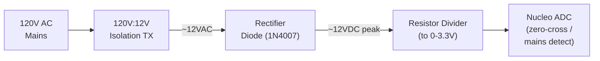

# Mains Contactor Control & Safety Shutdown

## Mains Path Order (system level)

```
AC Mains → EMI Filter → Contactor → Rectifier → DC Bus → H-Bridge
```

### Mains EMI Filter (chassis-mount)

A metal-cased mains EMI filter block (CW/YS-series type, 115/250V, 50A —
e.g. YS36Q1AN-50A). Internally a common-mode choke + X-caps (line-line) +
Y-caps (line-ground). Blocks the inverter's switching noise from conducting
back onto house wiring, and blocks incoming mains garbage.

- **Placement:** right where mains enters the enclosure, BEFORE the contactor.
- **⚠️ EARTH BOND REQUIRED:** the filter case MUST be solidly bonded to mains
  earth/safety ground. The Y-caps shunt common-mode noise to earth through the
  case. No ground = filter doesn't work AND the case can float to ~half mains
  voltage (shock hazard). Non-negotiable.
- **Keep input (unfiltered) wires away from output (filtered) wires** so noise
  doesn't couple across the gap.
- **GFCI note:** Y-cap leakage current can occasionally nuisance-trip a GFCI.
- Sized at 50A / 12kW — comfortable margin over actual draw.

## Contactor Control Overview

The contactor is a FUJI 100A 15kV unit. Its coil requires 120V AC to energize.
The Nucleo controls it indirectly through an isolation chain:

```
Nucleo GPIO → Optocoupler → 5V Logic Relay → 120V AC → Contactor Coil → Mains to H-Bridge
```

A separate sensing path provides AC mains presence detection and zero-crossing:

```
120V AC → Isolation TX (120V:12V) → Rectifier Diode → Voltage Divider → Nucleo ADC/GPIO
```

## Signal Flow — Contactor Control


## Signal Flow — AC Sensing (Zero-Cross / Mains Presence)



## Shutdown Sequence (Fault or Manual Stop)

Priority order — fastest action first:

1. **Kill PWM** — TIM1 BKIN fires (hardware, ~6ns) OR firmware clears MOE
   (`PwmDrive::disableOutputs()`)
2. **Drop contactor** — GPIO LOW → opto off → relay off → contactor drops → H-bridge de-energized
3. **Log fault** — record reason (OCP/temp/mains/manual) for display

> (No VCO inhibit step — that was the old ESP32/CD4046 analog-PLL design.
> The STM32 generates the PWM directly, so killing TIM1 output IS the kill.)

Note: Steps 1-2 happen in microseconds (firmware-driven). The contactor physically
opens in ~10-20ms (mechanical delay), but the PWM is already dead so IGBTs stop
switching immediately. The contactor just removes bus power as a secondary safety.

## Startup Sequence

1. Verify NTC temperature is below TEMP_SHUTDOWN
2. Verify mains presence (AC sense ADC reading > threshold)
3. Optionally wait for zero-crossing (reduces inrush/arcing)
4. Drive GPIO HIGH → opto → relay → contactor energizes
5. Wait for DC bus charge (BUS_CHARGE_DELAY ~200-500ms)
6. Enable PWM output (TIM1 outputs active)

## BOM — Mains Control Section

| Qty | Part | Value/Type | Package | Purpose | Notes |
|-----|------|-----------|---------|---------|-------|
| 1 | Optocoupler | 4N25 or PC817 | DIP-6/4 | Isolates Nucleo from relay coil | Slow speed is fine here (DC switching) |
| 1 | Resistor | 330Ω 1/4W | Through-hole | Opto LED current limit (~10mA from 3.3V) | |
| 1 | Diode | 1N4148 | Through-hole | Flyback protection across relay coil | Cathode to +5V side |
| 1 | 5V Logic Relay | 5V coil, NO contacts rated 250VAC 10A+ | Through-hole | Switches 120V AC to contactor coil | SRD-05VDC or similar |
| 1 | Transformer | 120V:12V isolation, low power (1-5W) | Through-hole/chassis | Provides isolated low-voltage AC for sensing | Small PCB mount or chassis type |
| 1 | Diode | 1N4007 | Through-hole | Rectify TX secondary for DC sensing | |
| 1 | Capacitor | 10µF 25V electrolytic | Through-hole | Smooth rectified TX output (optional — omit for zero-cross) | |
| 2 | Resistor | TBD (divider for 12V→3.3V) | Through-hole | Scale rectified AC to ADC-safe voltage | ~27kΩ + 10kΩ gives ~3.2V from 12V peak |
| 1 | Capacitor | 100nF ceramic | Through-hole | Filter on ADC input | |

> Note: If zero-cross detection is used, OMIT the smoothing capacitor (10µF) so the
> ADC sees the rectified sine wave and can detect when it crosses near zero.
> If only mains-present detection is needed, include the cap for a stable DC level.

## Pin Assignment

| Function | Nucleo Pin | Morpho | Notes |
|----------|-----------|--------|-------|
| Contactor control | PB14 (GPIO) | CN10-28 | → opto LED → relay → contactor. JST Conn2 Orange |
| AC sense (zero-cross) | **PC1 (ADC1_IN11)** | CN7-36 | Reads scaled rectified AC. JST Conn2 White |

> Note: PA4 is ADC_VBUS (bus voltage), NOT the AC sense. AC sense is PC1.
> Matches `PIN_ADC_AC` in `config.h`.

## Physical Notes

- The relay, optocoupler, and flyback diode mount on the **lower perf** with the
  Si8621 / IXDN630MCI / 74HC14 (all share the single star ground)
- The 120V wiring to/from the relay contacts should use proper gauge wire and
  be physically separated from all low-voltage traces
- The isolation transformer can be chassis-mounted off-board with wires to the PCB
  if it doesn't fit the perfboard footprint
- Contactor coil wires: use spade terminals or screw terminals, not soldered joints
  (the contactor vibrates when energized)

## Zero-Cross Detection (Optional Enhancement)

Without the smoothing cap, the ADC reads a rectified half-sine at 120Hz.
Firmware detects zero-crossing when the ADC value drops below a threshold
(e.g., < 100 counts). Switch the relay at that moment for clean contactor engagement.

```
ADC reading:  ╱╲  ╱╲  ╱╲  ╱╲
Zero-cross:  ↑  ↑  ↑  ↑  ↑  ↑   (every 8.3ms at 60Hz)
```

At 60Hz rectified = 120 zero-crossings per second. Maximum wait time to hit a
zero-cross is ~8.3ms. Negligible delay for startup, significant benefit for
contactor life and EMI.
