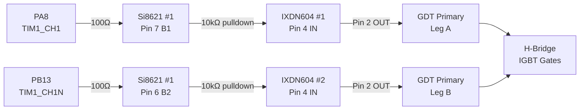
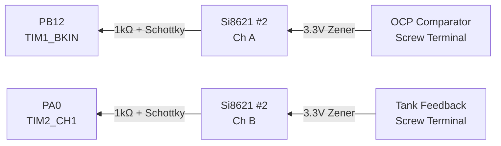
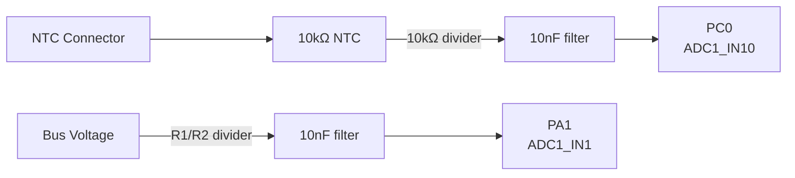
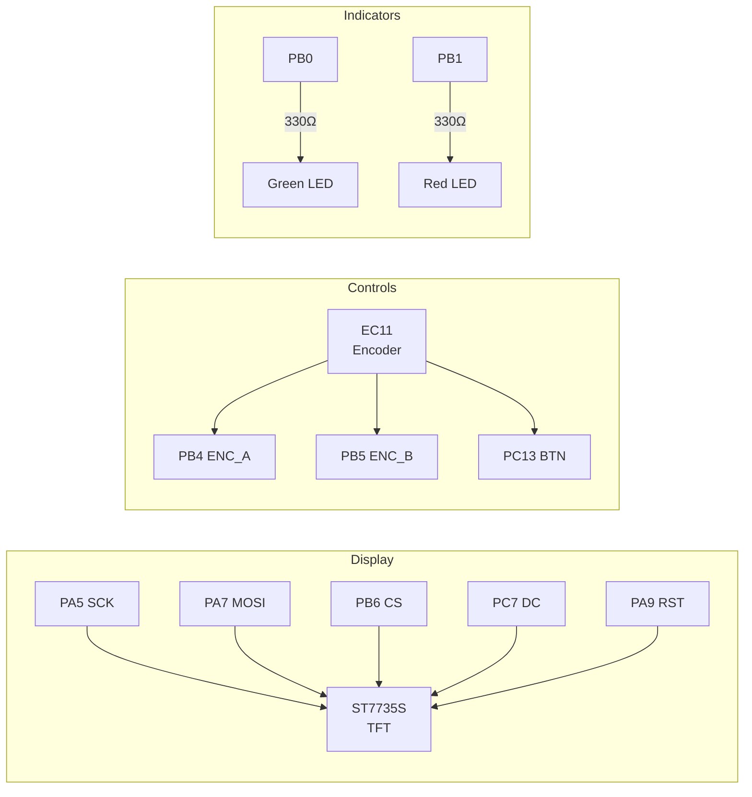
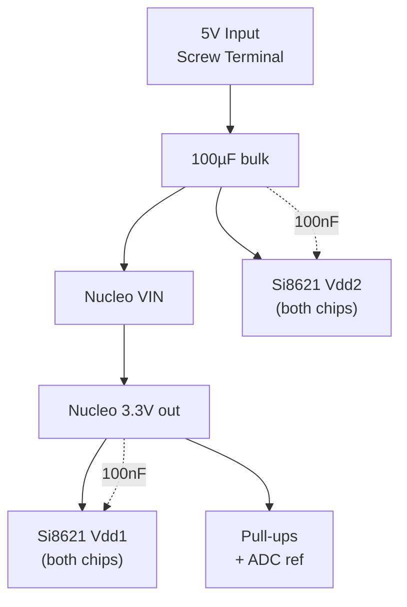
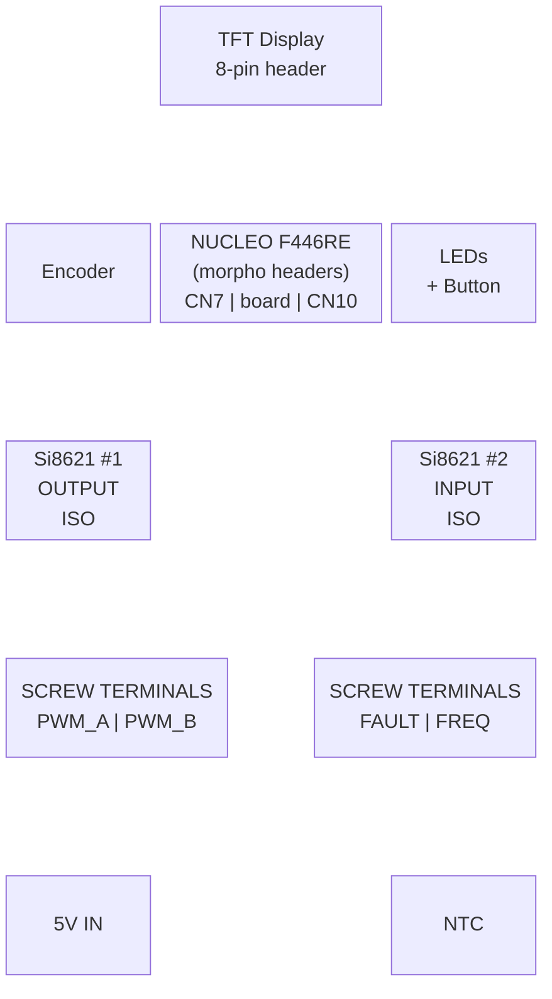

# Shield PCB Layout — Signal Flow & Connections

## PWM Output Path (Nucleo → Isolator → Gate Drivers → GDT)



## Fault & Feedback Input Path (Power Stage → Nucleo)



## Analog Sensing



## User Interface



## Power Distribution



## Physical Layout (Top View — Perfboard)



## Wiring Notes

### Isolation Boundary
- **LEFT side** of board = isolated outputs (PWM to gate drivers)
- **RIGHT side** of board = isolated inputs (fault + frequency feedback)
- **CENTER** = Nucleo + UI (safe/logic side)
- Ground planes: Logic GND and Power GND must NOT connect (isolation!)

### Critical Traces (keep short)
1. FAULT input → Si8621 #2 → PB12 (fastest path on the board)
2. PA8 → Si8621 #1 → PWM_A output connector
3. PB13 → Si8621 #1 → PWM_B output connector

### Power Routing
- 5V rail from input screw terminal → Nucleo VIN + Si8621 Vdd2 (power side)
- 3.3V from Nucleo → Si8621 Vdd1 (logic side) + pull-ups + ADC reference
- 100nF decoupling cap at EACH IC power pin
- 100µF bulk cap near 5V input terminal

### Si8621 Pinout (SOIC-8)

```
               ┌──────────┐
  VDD1/NCT   1 ┤          ├ 8  VDD2
    A1 (I/O) 2 ┤ Si8621BB ├ 7  B1 (I/O)
    A2 (I/O) 3 ┤          ├ 6  B2 (I/O)
       GND1  4 ┤          ├ 5  GND2/NC1
               └──────────┘

  Side 1 (pins 1-4):  Logic side — Nucleo 3.3V
  Side 2 (pins 5-8):  Power side — 5V from driver rail

  Channel A: A1 (pin 2) ↔ B1 (pin 7)
  Channel B: A2 (pin 3) ↔ B2 (pin 6)
```

### Si8621 #1 — OUTPUT Isolation (Nucleo → Gate Drivers)

| Pin | Name | Connection |
|-----|------|-----------|
| 1 | VDD1 | Nucleo 3.3V + 100nF cap to GND1 |
| 2 | A1 | PA8 (TIM1_CH1) via 100Ω series resistor |
| 3 | A2 | PB13 (TIM1_CH1N) via 100Ω series resistor |
| 4 | GND1 | Nucleo GND (logic ground) |
| 5 | GND2 | Power stage GND (isolated) |
| 6 | B2 | PWM_B screw terminal (+ 3.3V zener to GND2) |
| 7 | B1 | PWM_A screw terminal (+ 3.3V zener to GND2) |
| 8 | VDD2 | 5V driver rail + 100nF cap to GND2 |

*Signal flows: A1→B1 (PWM_A), A2→B2 (PWM_B)*

### Si8621 #2 — INPUT Isolation (Power Stage → Nucleo)

| Pin | Name | Connection |
|-----|------|-----------|
| 1 | VDD1 | Nucleo 3.3V + 100nF cap to GND1 |
| 2 | A1 | PB12 (TIM1_BKIN) via 1kΩ + schottky to 3.3V |
| 3 | A2 | PA0 (TIM2_CH1) via 1kΩ + schottky to 3.3V |
| 4 | GND1 | Nucleo GND (logic ground) |
| 5 | GND2 | Power stage GND (isolated) |
| 6 | B2 | FREQ feedback screw terminal (+ 3.3V zener to GND2) |
| 7 | B1 | FAULT input screw terminal (+ 3.3V zener to GND2) |
| 8 | VDD2 | 5V driver rail + 100nF cap to GND2 |

*Signal flows: B1→A1 (FAULT), B2→A2 (FREQ feedback)*

### IXDN604 Gate Drivers (on same PCB, 15V rail section)

```
         ┌─────────┐
   VCC 1 ┤         ├ (tab = GND)
   OUT 2 ┤ IXDN604 ├
   GND 3 ┤         ├
    IN 4 ┤         ├
    NC 5 ┤         ├
         └─────────┘
```

### IXDN604 #1 — PWM_A (non-inverting, drives GDT leg A)

| Pin | Name | Connection |
|-----|------|-----------|
| 1 | VCC | 15V gate drive supply + 100nF ceramic + 10µF electrolytic to GND |
| 2 | OUT | GDT primary winding leg A |
| 3 | GND | Power stage GND (same as Si8621 GND2) |
| 4 | IN | Si8621 #1 pin 7 (B1) via 10kΩ pulldown to GND |
| 5 | NC | No connection |

### IXDN604 #2 — PWM_B (non-inverting, drives GDT leg B)

| Pin | Name | Connection |
|-----|------|-----------|
| 1 | VCC | 15V gate drive supply + 100nF ceramic + 10µF electrolytic to GND |
| 2 | OUT | GDT primary winding leg B |
| 3 | GND | Power stage GND (same as Si8621 GND2) |
| 4 | IN | Si8621 #1 pin 6 (B2) via 10kΩ pulldown to GND |
| 5 | NC | No connection |

*Both IXDN604 are non-inverting. Complementary signals + dead-time handled by STM32 TIM1.*
*10kΩ pulldown on each input ensures gates stay OFF if signal cable disconnects.*

### Power Rails on Combined PCB

```
┌─────────────────────────────────────────────────────────┐
│                                                         │
│  [3.3V RAIL]          [5V RAIL]         [15V RAIL]     │
│  From Nucleo          From supply       Gate drive      │
│  Si8621 Vdd1          Si8621 Vdd2       IXDN604 VCC    │
│  Pull-ups             Nucleo VIN        (separate       │
│  ADC ref                                 supply)        │
│                                                         │
│  [LOGIC GND]          [POWER GND ─────── POWER GND]    │
│  Nucleo side          Si8621 side 2      IXDN side     │
│                                                         │
│  ════ ISOLATION BARRIER (no connection) ════            │
│                                                         │
└─────────────────────────────────────────────────────────┘

Note: 5V and 15V share the same POWER GND (they're on the same
side of the isolation barrier). Only LOGIC GND is separate.
```
