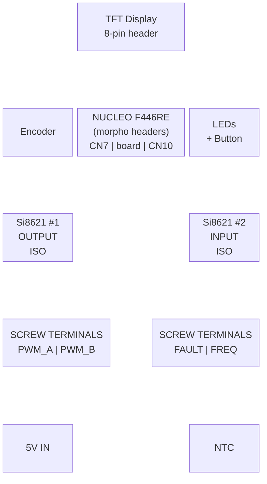

# Shield PCB Layout — Signal Flow & Connections

## System Block Diagram

```mermaid
graph TD
    subgraph NUCLEO["Nucleo F446RE (center of perfboard)"]
        PA8["PA8 — TIM1_CH1<br/>PWM_A"]
        PB13["PB13 — TIM1_CH1N<br/>PWM_B"]
        PB12["PB12 — TIM1_BKIN<br/>FAULT IN"]
        PA0["PA0 — TIM2_CH1<br/>FREQ Feedback"]
        PA1["PA1 — ADC1_IN1<br/>OCP Sense"]
        PC0["PC0 — ADC1_IN10<br/>NTC Temp"]
        PA5_SPI["PA5 — SPI1_SCK"]
        PA7_SPI["PA7 — SPI1_MOSI"]
        PB6["PB6 — TFT CS"]
        PC7["PC7 — TFT DC"]
        PA9["PA9 — TFT RST"]
        PB4["PB4 — TIM3_CH1<br/>ENC A"]
        PB5["PB5 — TIM3_CH2<br/>ENC B"]
        PC13["PC13 — ENC Button"]
        PB0["PB0 — Status LED"]
        PB1["PB1 — Fault LED"]
        VIN["VIN — 5V Input"]
        V33["3.3V Output"]
    end

    subgraph ISO1["Si8621 #1 — Output Isolation"]
        ISO1_A["CH_A: PWM_A"]
        ISO1_B["CH_B: PWM_B"]
    end

    subgraph ISO2["Si8621 #2 — Input Isolation"]
        ISO2_A["CH_A: FAULT"]
        ISO2_B["CH_B: FREQ"]
    end

    subgraph UI["User Interface"]
        TFT["1.8 ST7735S TFT"]
        ENC["EC11 Rotary Encoder"]
        BTN["Start/Stop Button"]
        LED_G["Green LED — Status"]
        LED_R["Red LED — Fault"]
    end

    subgraph ANALOG["Analog Inputs"]
        NTC["NTC 10k Thermistor"]
        VDIV["Bus Voltage Divider"]
    end

    subgraph CONNECTORS["Screw Terminals — To Power Stage"]
        PWM_A_OUT["PWM_A → Gate Driver"]
        PWM_B_OUT["PWM_B → Gate Driver"]
        FAULT_IN["FAULT ← OCP Comparator"]
        FREQ_IN["FREQ ← Tank Feedback"]
        POWER["5V Supply Input"]
        NTC_CONN["NTC Connector"]
    end

    %% Output path
    PA8 -->|"100Ω"| ISO1_A
    PB13 -->|"100Ω"| ISO1_B
    ISO1_A -->|"3.3V TVS"| PWM_A_OUT
    ISO1_B -->|"3.3V TVS"| PWM_B_OUT

    %% Input path
    FAULT_IN -->|"3.3V TVS"| ISO2_A
    FREQ_IN -->|"3.3V TVS"| ISO2_B
    ISO2_A -->|"1kΩ + Schottky"| PB12
    ISO2_B -->|"1kΩ + Schottky"| PA0

    %% Analog
    NTC_CONN --- NTC
    NTC -->|"10kΩ divider + 10nF"| PC0
    VDIV -->|"R divider + 10nF"| PA1

    %% UI
    PA5_SPI --> TFT
    PA7_SPI --> TFT
    PB6 --> TFT
    PC7 --> TFT
    PA9 --> TFT
    PB4 --> ENC
    PB5 --> ENC
    PC13 --> ENC
    PB0 -->|"330Ω"| LED_G
    PB1 -->|"330Ω"| LED_R

    %% Power
    POWER --> VIN
    V33 -->|"Vdd1"| ISO1
    V33 -->|"Vdd1"| ISO2
    POWER -->|"Vdd2"| ISO1
    POWER -->|"Vdd2"| ISO2
```



## Physical Layout (Top View — Perfboard)



## Wiring Notes

### Isolation Boundary
- **LEFT side** of board = isolated outputs (PWM to gate drivers)
- **RIGHT side** of board = isolated inputs (fault + frequency feedback)
- **CENTER** = Nucleo + UI (safe/logic side)
- Ground planes: Logic GND and Power GND must NOT connect (isolation!)

### Critical Traces (keep short)
1. FAULT input → Si8621 #2 → PB12 (fastest path on the board)
2. PA8 → Si8621 #1 → PWM_A output connector
3. PB13 → Si8621 #1 → PWM_B output connector

### Power Routing
- 5V rail from input screw terminal → Nucleo VIN + Si8621 Vdd2 (power side)
- 3.3V from Nucleo → Si8621 Vdd1 (logic side) + pull-ups + ADC reference
- 100nF decoupling cap at EACH IC power pin
- 100µF bulk cap near 5V input terminal

### Si8621 Pinout (SOIC-8)
```
        ┌───────┐
  Vdd1 ─┤1     8├─ Vdd2
  GND1 ─┤2     7├─ GND2
  IN_A ─┤3     6├─ OUT_A
  IN_B ─┤4     5├─ OUT_B
        └───────┘
```
- Pins 1-4: Logic side (Nucleo 3.3V)
- Pins 5-8: Power side (5V from driver rail)
- For input isolation (Si8621 #2): flip direction — signal enters on pin 6/5, exits on pin 3/4
