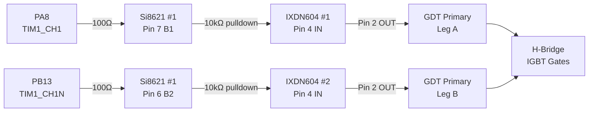
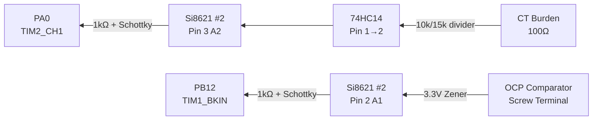
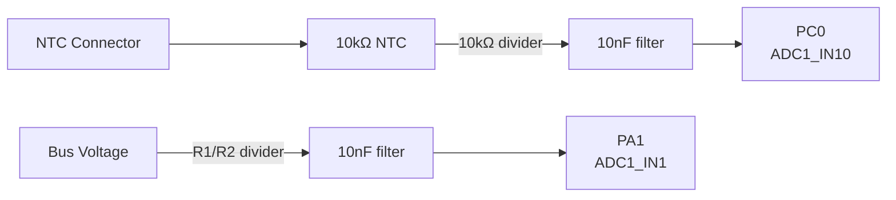
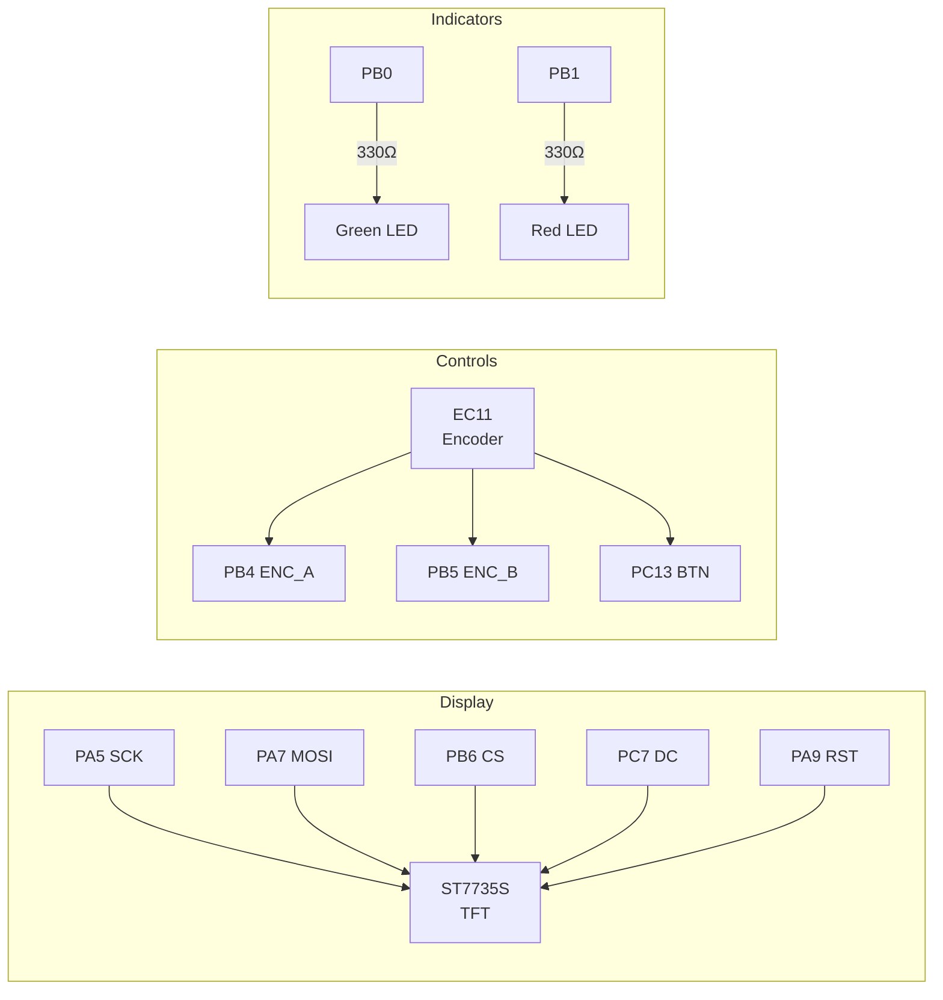
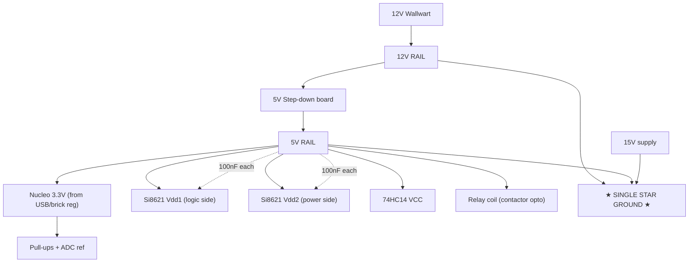
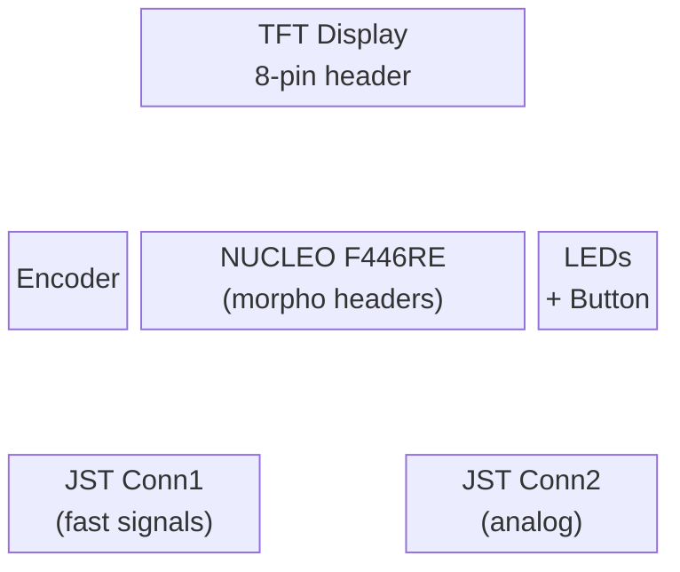
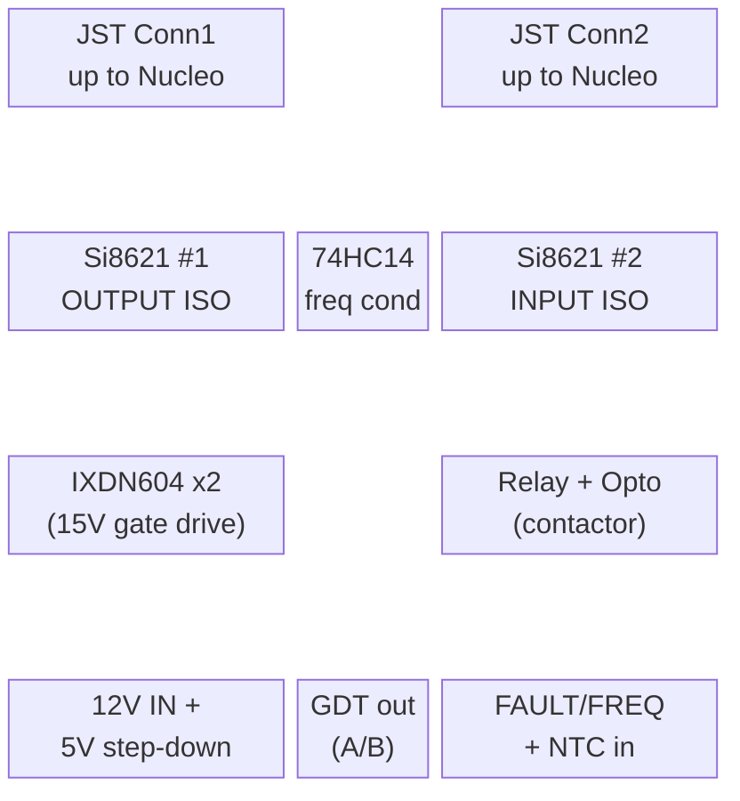

# Shield PCB Layout — Signal Flow & Connections

> Related docs: `JST_CONNECTORS.md` (inter-board wiring + colors),
> `NUCLEO_PINOUT.md` (pin map), `MAINS_CONTROL.md` (contactor safety),
> `BOM.md` (parts). Build is two stacked perfs joined by two 8-pin JST.

## PWM Output Path (Nucleo → Isolator → Gate Drivers → GDT)



## Fault & Feedback Input Path (Power Stage → Nucleo)



## Analog Sensing



## User Interface



## Power Distribution

**SINGLE STAR GROUND.** All grounds (Nucleo logic, 5V, 12V, 15V returns) tie
together at one star point. The Si8621 chips act as fast signal buffers /
level shifters rather than true galvanic isolators in this configuration —
they still give clean edges and some noise rejection. Chosen for simplicity;
revisit true isolation only if bench testing shows the MCU glitching under load.

Noise control relies on: single star ground, twisted signal leads (done),
and decoupling caps at every IC. The Nucleo runs from USB (bench) or a wall
brick; its ground meets the lower board ground at the star point.



**Rail summary (all share the single star ground):**

| Rail | Source | Powers |
|------|--------|--------|
| Nucleo | USB or wall brick | Nucleo + its 3.3V regulator |
| 3.3V | Nucleo onboard regulator | pull-ups, ADC ref |
| 12V | Wallwart | 5V step-down input |
| 5V | Step-down from 12V | Si8621 (both sides), 74HC14, relay coil |
| 15V | Separate supply | IXDN604 VCC (gate drive) |

> Si8621 GND1 (pin 4) and GND2 (pin 5) both tie to the single ground here.
> Vdd1 (pin 1) and Vdd2 (pin 8) both go to 5V. The chip still buffers the
> A↔B signals cleanly across pins.

## Physical Layout (Stacked Perfboards)

Two stacked perfboards joined by two 8-pin JST connectors (see
`JST_CONNECTORS.md`). Nucleo on the TOP perf (header-pin solder only, easy to
lift for access). Driver/isolation/IXDN on the LOWER perf.

**Top perf — Nucleo + UI:**



**Lower perf — isolation, drivers, power:**



## Wiring Notes

### Isolation Boundary
- **LEFT side** of board = isolated outputs (PWM to gate drivers)
- **RIGHT side** of board = isolated inputs (fault + frequency feedback)
- **CENTER** = Nucleo + UI (safe/logic side)
- Ground planes: Logic GND and Power GND must NOT connect (isolation!)

### Critical Traces (keep short)
1. FAULT input → Si8621 #2 → PB12 (fastest path on the board)
2. PA8 → Si8621 #1 → PWM_A output connector
3. PB13 → Si8621 #1 → PWM_B output connector

### Power Routing
- 12V wallwart → lower board 12V rail → up JST Conn1 (Red) to Nucleo VIN
  (7–12V required; 5V will NOT run the Nucleo regulator)
- 12V → adjustable step-down board → 5V rail → Si8621 Vdd2, 74HC14, relay coil
- 3.3V from Nucleo → down JST Conn1 (Blue) → Si8621 Vdd1 (logic side) +
  pull-ups + ADC reference
- 15V separate supply → IXDN604 VCC
- 100nF decoupling cap at EACH IC power pin
- 100µF bulk cap near the 12V input and 10µF near each IXDN604
- Nucleo jumper on **E5V** when running from external 12V; **U5V** when on USB

### Si8621 Pinout (SOIC-8)

```
               ┌──────────┐
  VDD1/NCT   1 ┤          ├ 8  VDD2
    A1 (I/O) 2 ┤ Si8621BB ├ 7  B1 (I/O)
    A2 (I/O) 3 ┤          ├ 6  B2 (I/O)
       GND1  4 ┤          ├ 5  GND2/NC1
               └──────────┘

  Side 1 (pins 1-4):  Logic side — Nucleo 3.3V
  Side 2 (pins 5-8):  Power side — 5V from driver rail

  Channel A: A1 (pin 2) ↔ B1 (pin 7)
  Channel B: A2 (pin 3) ↔ B2 (pin 6)
```

### Si8621 #1 — OUTPUT Isolation (Nucleo → Gate Drivers)

| Pin | Name | Connection |
|-----|------|-----------|
| 1 | VDD1 | Nucleo 3.3V + 100nF cap to GND1 |
| 2 | A1 | PA8 (TIM1_CH1) via 100Ω series resistor |
| 3 | A2 | PB13 (TIM1_CH1N) via 100Ω series resistor |
| 4 | GND1 | Nucleo GND (logic ground) |
| 5 | GND2 | Power stage GND (isolated) |
| 6 | B2 | PWM_B screw terminal (+ 3.3V zener to GND2) |
| 7 | B1 | PWM_A screw terminal (+ 3.3V zener to GND2) |
| 8 | VDD2 | 5V driver rail + 100nF cap to GND2 |

*Signal flows: A1→B1 (PWM_A), A2→B2 (PWM_B)*

### Si8621 #2 — INPUT Isolation (Power Stage → Nucleo)

| Pin | Name | Connection |
|-----|------|-----------|
| 1 | VDD1 | Nucleo 3.3V + 100nF cap to GND1 |
| 2 | A1 | PB12 (TIM1_BKIN) via 1kΩ + schottky to 3.3V |
| 3 | A2 | PA0 (TIM2_CH1) via 1kΩ + schottky to 3.3V |
| 4 | GND1 | Nucleo GND (logic ground) |
| 5 | GND2 | Power stage GND (isolated) |
| 6 | B2 | FREQ feedback screw terminal (+ 3.3V zener to GND2) |
| 7 | B1 | FAULT input screw terminal (+ 3.3V zener to GND2) |
| 8 | VDD2 | 5V driver rail + 100nF cap to GND2 |

*Signal flows: B1→A1 (FAULT), B2→A2 (FREQ feedback)*

### IXDN604 Gate Drivers (on same PCB, 15V rail section)

```
         ┌─────────┐
   VCC 1 ┤         ├ (tab = GND)
   OUT 2 ┤ IXDN604 ├
   GND 3 ┤         ├
    IN 4 ┤         ├
    NC 5 ┤         ├
         └─────────┘
```

### IXDN604 #1 — PWM_A (non-inverting, drives GDT leg A)

| Pin | Name | Connection |
|-----|------|-----------|
| 1 | VCC | 15V gate drive supply + 100nF ceramic + 10µF electrolytic to GND |
| 2 | OUT | GDT primary winding leg A |
| 3 | GND | Power stage GND (same as Si8621 GND2) |
| 4 | IN | Si8621 #1 pin 7 (B1) via 10kΩ pulldown to GND |
| 5 | NC | No connection |

### IXDN604 #2 — PWM_B (non-inverting, drives GDT leg B)

| Pin | Name | Connection |
|-----|------|-----------|
| 1 | VCC | 15V gate drive supply + 100nF ceramic + 10µF electrolytic to GND |
| 2 | OUT | GDT primary winding leg B |
| 3 | GND | Power stage GND (same as Si8621 GND2) |
| 4 | IN | Si8621 #1 pin 6 (B2) via 10kΩ pulldown to GND |
| 5 | NC | No connection |

*Both IXDN604 are non-inverting. Complementary signals + dead-time handled by STM32 TIM1.*
*10kΩ pulldown on each input ensures gates stay OFF if signal cable disconnects.*

### 74HC14 Schmitt Trigger — Frequency Feedback Conditioner

```
              ┌──────────────┐
         1A 1 ┤              ├ 14  VCC (5V power-side)
         1Y 2 ┤              ├ 13  6A
         2A 3 ┤              ├ 12  6Y
         2Y 4 ┤   74HC14    ├ 11  5A
         3A 5 ┤              ├ 10  5Y
         3Y 6 ┤              ├  9  4A
       GND  7 ┤              ├  8  4Y
              └──────────────┘
```

**Only Gate 1 used (pins 1, 2):**

| Pin | Connection |
|-----|-----------|
| 1 (1A input) | Junction of 10kΩ/15kΩ voltage divider from CT burden |
| 2 (1Y output) | Si8621 #2 pin 6 (B2) — frequency feedback to Nucleo |
| 7 (GND) | Power-side GND |
| 14 (VCC) | 5V power-side rail + 100nF decoupling |
| 3,5,9,11,13 | Unused inputs tied to GND or VCC (prevent floating/oscillation) |

*Note: 74HC14 is inverting — output is inverted relative to input.*
*This doesn't affect the PLL since it measures frequency/period, not polarity.*

### Power Rails on Combined PCB

```
┌──────────────────────────────────────────────────────────────────┐
│                                                                    │
│  [12V RAIL]      [3.3V RAIL]     [5V RAIL]        [15V RAIL]       │
│  Wallwart        From Nucleo     From step-down   Gate drive       │
│  → Nucleo VIN    Si8621 Vdd1     Si8621 Vdd2      IXDN604 VCC      │
│  → 5V step-down  Pull-ups        74HC14 VCC       (separate        │
│                  ADC ref         Relay coil        supply)         │
│                                                                    │
│  [LOGIC GND]                     [POWER GND ─────── POWER GND]     │
│  Nucleo side                     Si8621 side 2 / 74HC14 / relay    │
│                                  / IXDN side                       │
│                                                                    │
│  ════ ISOLATION BARRIER (no connection between L/P grounds) ════   │
│                                                                    │
└──────────────────────────────────────────────────────────────────┘

Notes:
- Nucleo VIN needs 7-12V; it runs from the 12V rail, NOT 5V.
- 5V and 15V share POWER GND (same side of the isolation barrier).
- The 12V rail and its derived 5V also sit on the power-side domain;
  only the Nucleo's LOGIC GND is isolated from POWER GND (via Si8621).
- The Nucleo's 3.3V (logic side) crosses DOWN to Si8621 Vdd1 only.
```
