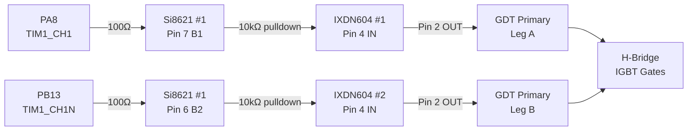
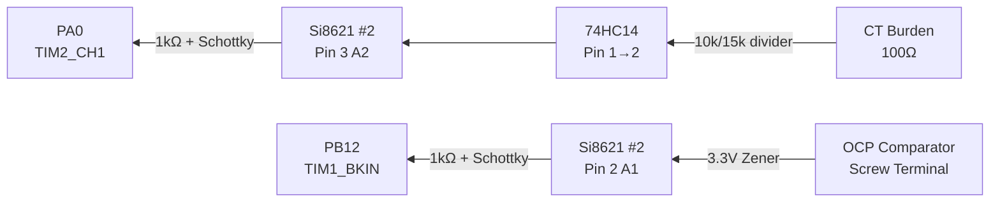
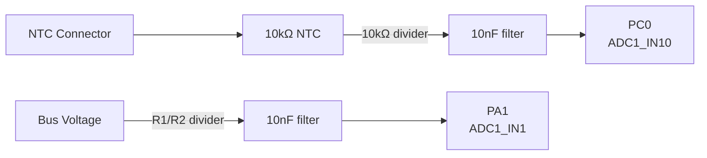
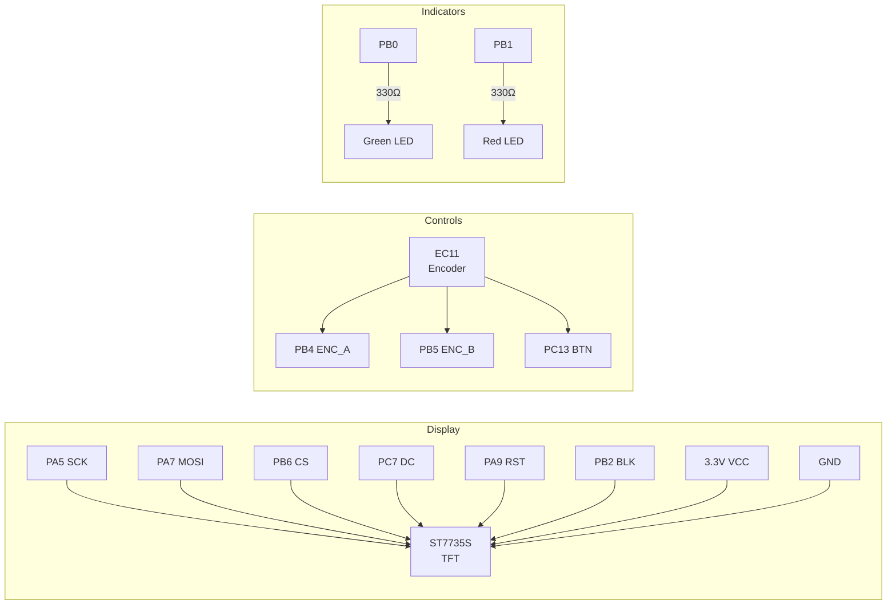
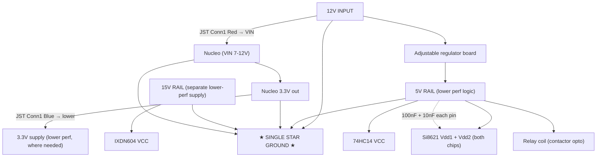
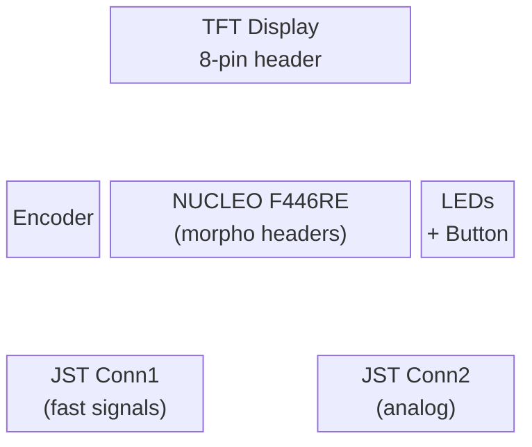
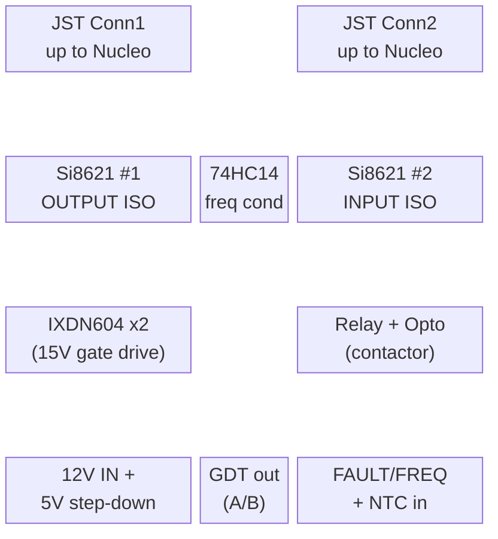

# Shield PCB Layout — Signal Flow & Connections

> Related docs: `JST_CONNECTORS.md` (inter-board wiring + colors),
> `NUCLEO_PINOUT.md` (pin map), `MAINS_CONTROL.md` (contactor safety),
> `BOM.md` (parts). Build is two stacked perfs joined by two 8-pin JST.

## PWM Output Path (Nucleo → Isolator → Gate Drivers → GDT)



## Fault & Feedback Input Path (Power Stage → Nucleo)



## Analog Sensing



## User Interface



## Power Distribution (AS-BUILT — authoritative)

**SINGLE STAR GROUND, shared 12V input.** One 12V input feeds everything.
It goes UP to the Nucleo VIN (via JST Conn1 Red) AND splits through an
adjustable regulator board to make the 5V logic rail on the lower perf. The
Nucleo's 3.3V comes back DOWN (JST Conn1 Blue) as a separate 3.3V supply for
the lower perf where needed. The 15V gate-drive rail is a separate lower-perf
rail. ALL grounds — 12V, 5V, 3.3V, 15V, Nucleo — meet at one star point.

The Si8621 chips act as fast signal buffers / level shifters (not true
galvanic isolators in this single-ground config) — still clean edges + some
noise rejection. Noise control: single star ground, twisted leads (done),
decoupling at every IC.



**Rail summary (all share the single star ground):**

| Rail | Source | Powers |
|------|--------|--------|
| 12V | 12V input (shared) | Nucleo VIN (up JST Conn1 Red) + regulator input |
| 5V | Adjustable regulator from 12V | Si8621 (both sides), 74HC14, relay coil |
| 3.3V | Nucleo regulator (down JST Conn1 Blue) | Lower-perf 3.3V loads, pull-ups, ADC ref |
| 15V | Separate lower-perf supply | IXDN604 VCC (gate drive) |

> Si8621: Vdd1 (pin 1) + Vdd2 (pin 8) → 5V; GND1 (pin 4) + GND2 (pin 5) → star
> ground. The chip buffers A↔B signals cleanly across the (now-unused as a
> barrier) isolation gap.

## Physical Layout (Stacked Perfboards)

Two stacked perfboards joined by two 8-pin JST connectors (see
`JST_CONNECTORS.md`). Nucleo on the TOP perf (header-pin solder only, easy to
lift for access). Driver/isolation/IXDN on the LOWER perf.

**Top perf — Nucleo + UI:**



**Lower perf — isolation, drivers, power:**



## Wiring Notes

### TFT Display Wiring (ST7735 1.8" — 8 pins, software SPI)

| TFT Pin | Nucleo Pin | Morpho  | Notes |
|---------|-----------|---------|-------|
| SCK/SCL | PA5       | CN10-11 | SPI clock |
| SDA/MOSI| PA7       | CN10-15 | SPI data |
| CS      | PB6       | CN10-17 | Chip select |
| DC/A0/RS| PC7       | CN10-19 | Data/command |
| RST     | PA9       | CN10-21 | Reset |
| BLK/LED | PB2       | CN10-22 | **Backlight — REQUIRED. Screen is dark if unwired.** |
| VCC     | 3.3V      | —       | Check module (some accept 5V via onboard reg) |
| GND     | GND       | —       | — |

> Lesson learned: BLK/backlight must be wired (driven HIGH). Without it the
> display appears completely dead even though SPI and logic are fine.

### Isolation Boundary
- **LEFT side** of board = isolated outputs (PWM to gate drivers)
- **RIGHT side** of board = isolated inputs (fault + frequency feedback)
- **CENTER** = Nucleo + UI (safe/logic side)
- Ground planes: Logic GND and Power GND must NOT connect (isolation!)

### Critical Traces (keep short)
1. FAULT input → Si8621 #2 → PB12 (fastest path on the board)
2. PA8 → Si8621 #1 → PWM_A output connector
3. PB13 → Si8621 #1 → PWM_B output connector

### Power Routing (as-built)
- 12V input → up JST Conn1 (Red) to Nucleo VIN (7–12V; 5V will NOT run the reg)
- 12V input → adjustable regulator board → 5V rail → Si8621 (both sides),
  74HC14, relay coil
- Nucleo 3.3V → down JST Conn1 (Blue) → separate 3.3V supply on lower perf
  where needed (+ pull-ups + ADC reference)
- 15V separate lower-perf rail → IXDN604 VCC
- ALL grounds → single star point (12V, 5V, 3.3V, 15V, Nucleo)
- 100nF (+10nF) decoupling at EACH IC power pin
- 100µF bulk near the 12V input, 10µF near each IXDN604, 47-100µF near the
  Si8621/74HC14/relay cluster
- Nucleo jumper on **E5V** when running from external 12V; **U5V** when on USB

### Si8621 Pinout (SOIC-8)

```
               ┌──────────┐
  VDD1/NCT   1 ┤          ├ 8  VDD2
    A1 (I/O) 2 ┤ Si8621BB ├ 7  B1 (I/O)
    A2 (I/O) 3 ┤          ├ 6  B2 (I/O)
       GND1  4 ┤          ├ 5  GND2/NC1
               └──────────┘

  Side 1 (pins 1-4):  Logic side — Nucleo 3.3V
  Side 2 (pins 5-8):  Power side — 5V from driver rail

  Channel A: A1 (pin 2) ↔ B1 (pin 7)
  Channel B: A2 (pin 3) ↔ B2 (pin 6)
```

> **SINGLE STAR GROUND build:** both VDD1 and VDD2 → 5V; both GND1 and GND2 →
> the single star ground. (Earlier drafts referenced a two-ground isolation
> scheme with 3.3V on the logic side — that was reverted. Wire per below.)

### Si8621 #1 — OUTPUT (PWM: Nucleo → Gate Drivers)

| Pin | Name | Connection |
|-----|------|-----------|
| 1 | VDD1 | 5V + 100nF (+ 10nF) cap to GND |
| 2 | A1 | PWM_A from Nucleo (PA8) via JST Conn1 Black, through 100Ω series |
| 3 | A2 | PWM_B from Nucleo (PB13) via JST Conn1 White, through 100Ω series |
| 4 | GND1 | Star ground |
| 5 | GND2 | Star ground |
| 6 | B2 | → IXDN604 #2 IN (PWM_B), via 10kΩ pulldown to GND |
| 7 | B1 | → IXDN604 #1 IN (PWM_A), via 10kΩ pulldown to GND |
| 8 | VDD2 | 5V + 100nF (+ 10nF) cap to GND |

*Signal flows: A1→B1 (PWM_A), A2→B2 (PWM_B)*

### Si8621 #2 — INPUT (Feedback + Fault: Power → Nucleo)

| Pin | Name | Connection |
|-----|------|-----------|
| 1 | VDD1 | 5V + 100nF (+ 10nF) cap to GND |
| 2 | A1 | → BKIN to Nucleo (PB12) via JST Conn1 Orange |
| 3 | A2 | → FREQ_FB to Nucleo (PA0) via JST Conn1 Green |
| 4 | GND1 | Star ground |
| 5 | GND2 | Star ground |
| 6 | B2 | FREQ feedback IN ← 74HC14 output |
| 7 | B1 | FAULT IN ← OCP comparator |
| 8 | VDD2 | 5V + 100nF (+ 10nF) cap to GND |

*Signal flows: B1→A1 (FAULT), B2→A2 (FREQ feedback)*

### IXDN604 Gate Drivers (on same PCB, 15V rail section)

```
         ┌─────────┐
   VCC 1 ┤         ├ (tab = GND)
   OUT 2 ┤ IXDN604 ├
   GND 3 ┤         ├
    IN 4 ┤         ├
    NC 5 ┤         ├
         └─────────┘
```

### IXDN604 #1 — PWM_A (non-inverting, drives GDT leg A)

| Pin | Name | Connection |
|-----|------|-----------|
| 1 | VCC | 15V gate drive supply + 100nF ceramic + 10µF electrolytic to GND |
| 2 | OUT | GDT primary winding leg A |
| 3 | GND | Power stage GND (same as Si8621 GND2) |
| 4 | IN | Si8621 #1 pin 7 (B1) via 10kΩ pulldown to GND |
| 5 | NC | No connection |

### IXDN604 #2 — PWM_B (non-inverting, drives GDT leg B)

| Pin | Name | Connection |
|-----|------|-----------|
| 1 | VCC | 15V gate drive supply + 100nF ceramic + 10µF electrolytic to GND |
| 2 | OUT | GDT primary winding leg B |
| 3 | GND | Power stage GND (same as Si8621 GND2) |
| 4 | IN | Si8621 #1 pin 6 (B2) via 10kΩ pulldown to GND |
| 5 | NC | No connection |

*Both IXDN604 are non-inverting. Complementary signals + dead-time handled by STM32 TIM1.*
*10kΩ pulldown on each input ensures gates stay OFF if signal cable disconnects.*

### 74HC14 Schmitt Trigger — Frequency Feedback Conditioner

```
              ┌──────────────┐
         1A 1 ┤              ├ 14  VCC (5V power-side)
         1Y 2 ┤              ├ 13  6A
         2A 3 ┤              ├ 12  6Y
         2Y 4 ┤   74HC14    ├ 11  5A
         3A 5 ┤              ├ 10  5Y
         3Y 6 ┤              ├  9  4A
       GND  7 ┤              ├  8  4Y
              └──────────────┘
```

**Only Gate 1 used (pins 1, 2):**

| Pin | Connection |
|-----|-----------|
| 1 (1A input) | Junction of 10kΩ/15kΩ voltage divider from CT burden |
| 2 (1Y output) | Si8621 #2 pin 6 (B2) — frequency feedback to Nucleo |
| 7 (GND) | Power-side GND |
| 14 (VCC) | 5V power-side rail + 100nF decoupling |
| 3,5,9,11,13 | Unused inputs tied to GND or VCC (prevent floating/oscillation) |

*Note: 74HC14 is inverting — output is inverted relative to input.*
*This doesn't affect the PLL since it measures frequency/period, not polarity.*

### Power Rails on Combined PCB

```
┌──────────────────────────────────────────────────────────────────┐
│                                                                    │
│  [12V RAIL]      [3.3V RAIL]     [5V RAIL]        [15V RAIL]       │
│  Wallwart        From Nucleo     From step-down   Gate drive       │
│  → Nucleo VIN    Si8621 Vdd1     Si8621 Vdd2      IXDN604 VCC      │
│  → 5V step-down  Pull-ups        74HC14 VCC       (separate        │
│                  ADC ref         Relay coil        supply)         │
│                                                                    │
│  [LOGIC GND]                     [POWER GND ─────── POWER GND]     │
│  Nucleo side                     Si8621 side 2 / 74HC14 / relay    │
│                                  / IXDN side                       │
│                                                                    │
│  ════ ISOLATION BARRIER (no connection between L/P grounds) ════   │
│                                                                    │
└──────────────────────────────────────────────────────────────────┘

Notes:
- Nucleo VIN needs 7-12V; it runs from the 12V rail, NOT 5V.
- 5V and 15V share POWER GND (same side of the isolation barrier).
- The 12V rail and its derived 5V also sit on the power-side domain;
  only the Nucleo's LOGIC GND is isolated from POWER GND (via Si8621).
- The Nucleo's 3.3V (logic side) crosses DOWN to Si8621 Vdd1 only.
```
